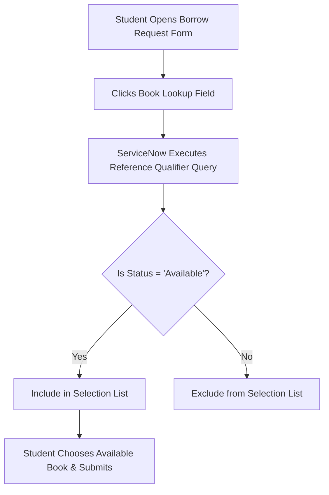

# Smart Library Request Workflow in ServiceNow
## Section 10: Configure Reference Qualifier Documentation

## 1. Objective
The objective of this task is to configure a Reference Qualifier on the Book reference field in the Borrow Request (`u_borrow_request`) table. This configuration ensures that students can only select books whose status is Available, preventing requests for books that are already issued or lost.

## 2. Introduction
A Reference Qualifier in ServiceNow is used to filter the records displayed in a reference field. Instead of displaying all records from the referenced table, it displays only those that satisfy a specified condition.

In the Smart Library Request Workflow, the Book field references the Book (`u_book`) table. Without a Reference Qualifier, students would be able to select books that are already issued or unavailable. By configuring the qualifier, only books with the status Available are displayed, improving usability and preventing invalid requests.

---

## 3. Prerequisites
Before performing this task, ensure that:
* ServiceNow Personal Developer Instance (PDI) is active.
* Administrator (`admin`) access is available.
* The Book (`u_book`) table contains a Status field (via Task 8).
* The Borrow Request (`u_borrow_request`) table contains the Book reference field (via Task 9).
* The Status field includes the choice value Available.

---

## 4. Purpose of Reference Qualifier
The Reference Qualifier provides the following benefits:
* **Displays Only Available Books**: Hides books that are checked out or lost.
* **Prevents Duplicate Borrowing Requests**: Eliminates cases where multiple students request the same unique copy.
* **Improves User Experience**: Prevents disappointment by showing only fulfillable choices.
* **Reduces Manual Verification by Librarians**: Autofilters out unfulfillable borrow requests.
* **Maintains Accurate Inventory Records**: Enforces database rules at the interface level.

---

## 5. Implementation Steps

### Step 1: Open the Tables Module
1. Log in to your ServiceNow instance.
2. Click **All** in the Application Navigator.
3. Search for **Tables** and open **System Definition** ──> **Tables**.

#### UI Mockup 1: Open Tables Module Navigation
```
================================================================================
|  ServiceNow  |  Filter Navigator: [ tables         ]  | User Profile (Admin) |
================================================================================
|  All | Favorites | History | Developer                                       |
--------------------------------------------------------------------------------
|  ▼ System Definition                                                         |
|    - Dictionary                                                              |
|    * Tables   <=== (Select this to open the list of all tables)              |
================================================================================
```
*Figure 1: Opening the Tables module.*

---

### Step 2: Open the Borrow Request Table
1. Search for `Borrow Request` (table label) or `u_borrow_request` (table name).
2. Open the table record.

#### UI Mockup 2: u_borrow_request Table Configuration
```
================================================================================
|  Table  |  Borrow Request [u_borrow_request]                 [ Update ] [ < ] |
================================================================================
|  * Label:    [ Borrow Request                      ]  Name: [ u_borrow_req  ] |
================================================================================
```
*Figure 2: Borrow Request table opened for configuration.*

---

### Step 3: Open the Book Reference Field
1. Scroll down to the **Columns (Dictionary)** related list.
2. Locate and open the row where column name is `u_book`.

#### UI Mockup 3: Opening the Book Reference Field in Dictionary
```
================================================================================
|  Columns (Dictionary)                                                        |
================================================================================
|  Column Label (▲) | Column Name | Type      | Reference  | Active | Default   |
--------------------------------------------------------------------------------
|  Book             | u_book      | Reference | u_book     | true   |           |
================================================================================
```
*Figure 3: Opening the Book reference field.*

---

### Step 4: Enable Advanced View
If the Reference Qualifier configuration panel is not visible on the Dictionary Entry form:
1. Click the **Advanced View** option under the Related Links of the form.
2. The form will reload, exposing advanced configuration sections.

#### UI Mockup 4: Dictionary Entry Related Links
```
================================================================================
|  Dictionary Entry  |  Book [u_book]                           [ Update ] [ < ]|
================================================================================
|  Related Links:                                                              |
|  * Show Dependency Map                                                       |
|  * Advanced View   <=== (Click this to reveal reference filtering fields)    |
================================================================================
```
*Figure 4: Enabling the Advanced View for the Dictionary Entry.*

---

### Step 5: Configure the Reference Qualifier
1. Scroll down to the **Reference Specification** tab.
2. Set the properties as follows:
   * **Use reference qualifier**: `Simple`
   * **Reference qual condition**: Set the condition builder to `Status is Available`.
3. Click **Update** to save dictionary changes.

#### UI Mockup 5: Configuring Reference Qualifier Filter
```
================================================================================
|  Reference Specification (Advanced View)                                     |
================================================================================
|  * Reference:              [ Book [u_book]                              |▼] |
|  * Use reference qualifier: [ Simple                                     |▼] |
|  * Reference qual condition:                                                 |
|    ------------------------------------------------------------------------  |
|    [ Status           ] [ is            ] [ Available                   |▼]  |
|    ------------------------------------------------------------------------  |
================================================================================
```
*Figure 5: Configuring the Reference Qualifier with the condition Status = Available.*

---

## 6. Working of the Reference Qualifier

### Before Configuration (No Filter)
Students opening the book lookup list see all books in the catalog:
* ✔ Java Programming (Available)
* ✔ Python Basics (Issued)
* ✔ Database Systems (Available)
* ✔ Cloud Computing (Lost)
* ✔ Operating Systems (Available)

### After Configuration (Reference Qualifier Active)
Students click the lookup field and see only ready-to-borrow books:
* ✔ Java Programming (Available)
* ✔ Database Systems (Available)
* ✔ Operating Systems (Available)
* *(Python Basics and Cloud Computing are automatically filtered out)*

---

## 7. Workflow Illustration


---

## 8. Expected Outcome
After completing this task:
* The Book reference field displays only available books.
* Issued books are hidden from students.
* Lost books cannot be selected.
* Invalid borrow requests are prevented.
* Book availability is enforced automatically.

## 9. Benefits
* Prevents duplicate book requests.
* Improves data accuracy.
* Enhances user experience.
* Reduces librarian workload.
* Supports workflow automation.
* Maintains library inventory consistency.
* Eliminates manual validation.

---

## 10. Verification
To verify the configuration:
1. Create a few book records in the `u_book` table.
2. Set one book status to **Available** (e.g. *Java Programming*).
3. Set another book status to **Issued** (e.g. *Python Basics*).
4. Open a new Borrow Request record (`u_borrow_request.do`).
5. Click the lookup icon (magnifying glass) on the **Book** field.

**Expected Result**: Only the book *Java Programming* is visible. *Python Basics* is hidden.

#### UI Mockup 6: Search Lookup Popup Verification
```
================================================================================
|  Books  |  Search: [ Title ] [ * ]                                   [ X ]   |
================================================================================
|  Title (▼)                 | Author                   | Status               |
--------------------------------------------------------------------------------
|  Java Programming          | Herbert Schildt          | Available            |
|  Database Systems          | Abraham Silberschatz     | Available            |
|  Operating Systems         | Abraham Silberschatz     | Available            |
================================================================================
|  Showing 3 of 3 records (Books with Status 'Issued' or 'Lost' are hidden)    |
================================================================================
```
*Figure 6: Book reference field displaying only available books.*

---

## 11. Conclusion
The Reference Qualifier configuration enhances the Smart Library Request Workflow by ensuring that students can request only books that are currently available. This validation improves system reliability, reduces manual intervention, and prevents duplicate or invalid borrowing requests. By filtering the Book reference field based on the Status value, the application maintains accurate inventory management and provides a better user experience for both students and librarians.
