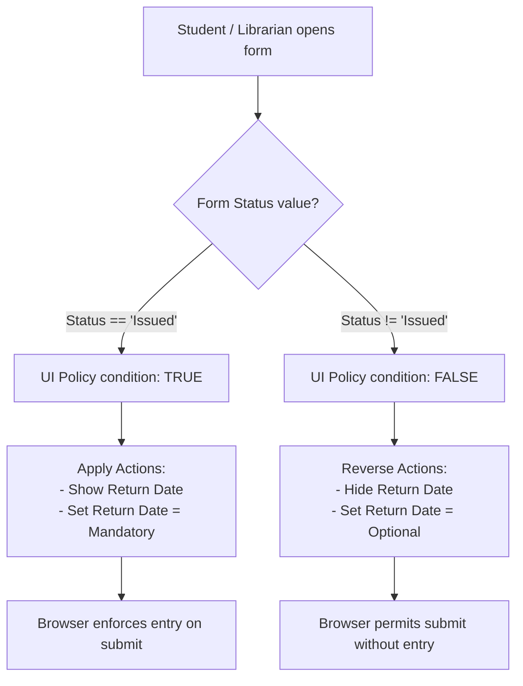

# Smart Library Request Workflow in ServiceNow
## Section 12: Create UI Policy Documentation

## 1. Objective
The objective of this task is to create a UI Policy in ServiceNow that dynamically controls the Borrow Request form based on the request status. When the Status is Issued, the Return Date field becomes mandatory and visible, ensuring that librarians record the expected return date before completing the borrowing process.

## 2. Introduction
A UI Policy in ServiceNow is a client-side feature that changes the behavior of form fields without writing any client-side scripts. It can make fields mandatory, read-only, or visible based on specified conditions.

In the Smart Library Request Workflow application, a UI Policy improves data quality by ensuring that a Return Date is provided whenever a book is issued. This prevents incomplete records and helps the library track when borrowed books should be returned.

---

## 3. Prerequisites
Before creating the UI Policy, ensure that:
* ServiceNow Personal Developer Instance (PDI) is active.
* Administrator (`admin`) access is available.
* The Borrow Request (`u_borrow_request`) table exists.
* The Status field contains the value `Issued`.
* The Return Date field exists in the Borrow Request table.

---

## 4. UI Policy Overview

| Property | Configuration Setting | Value / Details |
| :--- | :--- | :--- |
| **UI Policy Name** | Short Description | Make Return Date Mandatory when Issued |
| **Table** | Target Table | Borrow Request (`u_borrow_request`) |
| **Conditions** | Filter Condition Builder | `Status` is `Issued` |
| **Affected Field** | Field Name | `u_return_date` (Return Date) |
| **Actions** | UI Policy Action rules | `Mandatory` = `True`<br/>`Visible` = `True`<br/>`Read Only` = `False` |

---

## 5. Implementation Steps

### Step 1 – Open UI Policies
1. Log in to your ServiceNow instance.
2. Click **All** in the Application Navigator.
3. Search for **UI Policies** and open **System UI** ──> **UI Policies**.

#### UI Mockup 1: UI Policies Navigation
```
================================================================================
|  ServiceNow  |  Filter Navigator: [ UI Policies    ]  | User Profile (Admin) |
================================================================================
|  All | Favorites | History | Developer                                       |
--------------------------------------------------------------------------------
|  ▼ System UI                                                                 |
|    - UI Actions                                                              |
|    * UI Policies  <=== (Select this to open the UI Policies list)            |
|    - UI Scripts                                                              |
================================================================================
```
*Figure 1: Opening the UI Policies module.*

---

### Step 2 – Create a New UI Policy
1. Click the **New** button in the list header.
2. Configure the following fields:
   * **Table**: `Borrow Request [u_borrow_request]`
   * **Short Description**: `Make Return Date mandatory when Issued`
3. Click **Submit** (or save the record to remain on the page).

#### UI Mockup 2: UI Policy Definition Form
```
================================================================================
|  UI Policy  |  New Record                                         [ Submit ] |
================================================================================
|  * Table:             [ Borrow Request [u_borrow_request]                |▼] |
|    Active:            [x]               Global:          [x]                 |
|  * Short description: [ Make Return Date mandatory when Issued             ] |
================================================================================
```
*Figure 2: Creating a new UI Policy.*

---

### Step 3 – Configure the Condition
1. Reopen the newly created UI Policy from the list.
2. Under the **When to Apply** section / Conditions builder, set:
   * `Status [u_status] is Issued`
3. Save or update the record.

#### UI Mockup 3: Configuring the Status = Issued Condition
```
================================================================================
|  When to Apply                                                               |
================================================================================
|  Conditions:                                                                 |
|     [ Status           ] [ is            ] [ Issued                     |▼]  |
|                                                                              |
|  Reverse if false: [x]                 Inherit: [ ]                          |
================================================================================
```
*Figure 3: Configuring the condition Status = Issued.*

---

### Step 4 – Create UI Policy Action
1. Scroll down to the **UI Policy Actions** related list at the bottom of the form.
2. Click the **New** button.
3. Configure the Action properties:
   * **Field name**: `Return Date` (or `u_return_date`)
   * **Mandatory**: `True`
   * **Visible**: `True`
   * **Read Only**: `False`
4. Click **Submit**.

#### UI Mockup 4: UI Policy Action Configuration Form
```
================================================================================
|  UI Policy Action  |  New Record                              [ Submit ] [ < ]|
================================================================================
|  * UI Policy:   [ Make Return Date mandatory when Issued                 ]   |
|  * Field name:  [ Return Date                                            |▼] |
|    Mandatory:   [ True                                                   |▼] |
|    Visible:     [ True                                                   |▼] |
|    Read Only:   [ False                                                  |▼] |
================================================================================
```
*Figure 4: Configuring the UI Policy Action for the Return Date field.*

---

### Step 5 – Save and Verify
1. Open the Borrow Request form (`u_borrow_request.do`).
2. Initially, check that `Return Date` is either hidden or optional.
3. Change the **Status** drop-down selection to **Issued**.
4. Check that **Return Date** instantly appears on the form decorated with a red mandatory asterisk (`*`).

#### UI Mockup 5: Form Verification (Status = Issued)
```
================================================================================
|  Borrow Request  |  BR0001004                                 [ Update ] [ < ] |
================================================================================
|  Requested By:  [ John Doe                                               ]   |
|  Book:          [ Java Programming                                       ]   |
|  Request Date:  [ 2026-06-30 17:42:03                                    ]   |
|  Status:        [ Issued                                                 |▼] |
| *Return Date:   [ 2026-07-14 17:00:00                                  |🗓️] |
================================================================================
```
*Figure 5: Return Date becomes mandatory when the Status is Issued.*

---

## 6. UI Policy Flowchart
The client-side condition verification triggers dynamic field behaviors on the web browser layout as shown:


---

## 7. Testing the UI Policy
To verify correct client-side validation rules, run test cases in the browser:

| Test Case | Status Selected | Expected Field Behavior | Validation Message | Verification |
| :--- | :--- | :--- | :--- | :---: |
| **1. Request State** | `Requested` | Return Date is hidden & optional | None | ✔ Verified |
| **2. Approval State** | `Approved` | Return Date is hidden & optional | None | ✔ Verified |
| **3. Issued State** | `Issued` | Return Date is visible & mandatory | Mandatory field decoration visible | ✔ Verified |
| **4. Save Verification**| `Issued` (Date Empty) | Prevent form submit | *"The following mandatory fields are not filled: Return Date"* | ✔ Verified |

#### UI Mockup 6: Form Validation Error Alert
```
================================================================================
|  (X) The following mandatory fields are not filled: Return Date               |
================================================================================
|  Borrow Request  |  BR0001004                                 [ Update ] [ < ] |
|                                                                              |
|  Status:        [ Issued                                                 |▼] |
| *Return Date:   [                                                      |🗓️] |
|                  ^^^^^^^^^^^^^^^^^^^^^^^^^^^^^^^^^^^^^^^^^^^^^^^^^^^^^^      |
|                  Error: Field is empty but marked mandatory                  |
================================================================================
```
*Figure 6: Validation displayed because the mandatory Return Date field is empty.*

---

## 8. Expected Outcome
After completing this task:
* The UI Policy is successfully created.
* The policy triggers only when Status = Issued.
* The Return Date field becomes visible.
* The Return Date field becomes mandatory.
* Borrow request records maintain complete return information.

## 9. Benefits
* **Improves Data Quality**: Guarantees return tracking bounds.
* **Reduces Incomplete Records**: Eliminates transactions with empty return dates.
* **Client-side Interception**: Prevents server roundtrips, reducing system load.
* **Dynamic UX**: Exposes the field only when relevant, preventing clutter on initial request forms.
* **Consistent Auditing**: Protects librarians against saving incomplete active loans.

## 10. Conclusion
The UI Policy enhances the Smart Library Request Workflow by dynamically controlling the Borrow Request form based on the request status. Making the Return Date field mandatory when a book is issued ensures that essential return information is captured before the borrowing process is completed. This improves data accuracy, supports better tracking of borrowed books, and contributes to a more reliable and user-friendly library management system.
