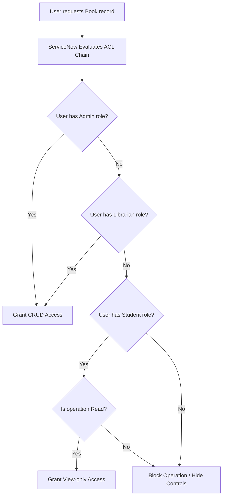

# Smart Library Request Workflow in ServiceNow
## Section 13: Access Control for Book Table Documentation

## 1. Objective
The objective of this task is to implement Access Control Lists (ACLs) for the Book (`u_book`) table to ensure secure and role-based access. The configuration allows students to view book records while granting librarians full permissions to create, update, and delete book information. This protects the integrity of the library database and prevents unauthorized modifications.

## 2. Introduction
Access Control Lists (ACLs) in ServiceNow determine who can Create, Read, Write, and Delete (CRUD) records. ACLs are essential for implementing Role-Based Access Control (RBAC), ensuring that users only perform actions permitted by their assigned roles.

In the Smart Library Request Workflow:
* Students can only view available books.
* Librarians can create, update, and delete book records.
* Unauthorized users cannot access the Book table.

---

## 3. Prerequisites
Before configuring ACLs, ensure that:
* ServiceNow Personal Developer Instance (PDI) is active.
* Administrator (`admin`) access is available.
* The Book (`u_book`) table has been created (via Task 6).
* The roles `student` (`x_library.student`) and `librarian` (`x_library.librarian`) are available (via Task 5).

---

## 4. Access Control Requirements

| Operation | Student Role (`x_library.student`) | Librarian Role (`x_library.librarian`) |
| :--- | :---: | :---: |
| **Read (view)** | ✔ Allowed | ✔ Allowed |
| **Create (add)** | ✘ Denied | ✔ Allowed |
| **Write (edit)** | ✘ Denied | ✔ Allowed |
| **Delete (remove)** | ✘ Denied | ✔ Allowed |

---

## 5. Implementation Steps

### Step 1 – Open Access Control Rules
1. Log in to your ServiceNow instance.
2. Click **All** in the Application Navigator.
3. Search for **Access Control** or **ACL**.
4. Select **System Security** ──> **Access Control (ACL)**.

#### UI Mockup 1: Access Control Navigation
```
================================================================================
|  ServiceNow  |  Filter Navigator: [ Access Control ]  | User Profile (Admin) |
================================================================================
|  All | Favorites | History | Developer                                       |
--------------------------------------------------------------------------------
|  ▼ System Security                                                           |
|    * Access Control (ACL)  <=== (Select this to open the ACL list)            |
|    - High Security Settings                                                  |
================================================================================
```
*Figure 1: Opening the Access Control (ACL) module.*

---

### Step 2 – Create Read ACL
1. Click the **New** button in the list header.
2. Configure the following properties:
   * **Type**: `record`
   * **Operation**: `read`
   * **Name**: `Book [u_book]` ──> `*` (All fields)
3. Scroll to the **Requires role** related list.
4. Click **Double-click to add** and add: `x_library.student` and `x_library.librarian`.
5. Click **Submit**.

#### UI Mockup 2: Read ACL Configuration
```
================================================================================
|  Access Control  |  New Record                                    [ Submit ] |
================================================================================
|  * Type:            [ record                                             |▼] |
|  * Operation:       [ read                                               |▼] |
|  * Name:            [ Book [u_book]                    |▼] [ *           |▼] |
--------------------------------------------------------------------------------
|  Requires Role:                                                              |
|  [+] x_library.student                                                       |
|  [+] x_library.librarian                                                     |
================================================================================
```
*Figure 2: Read ACL allowing Students and Librarians to view books.*

---

### Step 3 – Create Create ACL
1. Click **New**.
2. Configure the following properties:
   * **Type**: `record`
   * **Operation**: `create`
   * **Name**: `Book [u_book]` ──> `*`
3. Scroll to **Requires role** and add: `x_library.librarian`.
4. Click **Submit**.

#### UI Mockup 3: Create ACL Configuration
```
================================================================================
|  Access Control  |  New Record                                    [ Submit ] |
================================================================================
|  * Type:            [ record                                             |▼] |
|  * Operation:       [ create                                             |▼] |
|  * Name:            [ Book [u_book]                    |▼] [ *           |▼] |
--------------------------------------------------------------------------------
|  Requires Role:                                                              |
|  [+] x_library.librarian                                                     |
================================================================================
```
*Figure 3: Create ACL allowing only Librarians to add books.*

---

### Step 4 – Create Write ACL
1. Click **New**.
2. Configure:
   * **Type**: `record`
   * **Operation**: `write`
   * **Name**: `Book [u_book]` ──> `*`
3. Add role requirement: `x_library.librarian`.
4. Click **Submit**.

---

### Step 5 – Create Delete ACL
1. Click **New**.
2. Configure:
   * **Type**: `record`
   * **Operation**: `delete`
   * **Name**: `Book [u_book]` (Table level, no column selector)
3. Add role requirement: `x_library.librarian`.
4. Click **Submit**.

---

## 6. ACL Permission Matrix

| User Role / Group | Read | Create | Write | Delete |
| :--- | :---: | :---: | :---: | :---: |
| **Student** (`student`) | ✔ | ✘ | ✘ | ✘ |
| **Librarian** (`librarian`) | ✔ | ✔ | ✔ | ✔ |
| **Admin** (`admin`) | ✔ | ✔ | ✔ | ✔ |

---

## 7. Security Workflow
The ServiceNow ACL evaluation engine runs server-side security checks before rendering controls or lists:


---

## 8. Testing Access Controls
Verification of safety profiles is conducted using the **Impersonate User** capability:

| Step | Action | Expected ServiceNow Behavior | Result | Verification |
| :--- | :--- | :--- | :--- | :---: |
| **1** | Impersonate **Student** user | "New" button hidden; forms open read-only. | Can view books | ✔ Pass |
| **2** | Student edits *ISBN* field | Field input disabled or submit returns error. | Access denied | ✔ Pass |
| **3** | Student clicks "Delete" | Delete button is hidden from form context. | Access denied | ✔ Pass |
| **4** | Impersonate **Librarian** user| "New" button visible on Book list header. | Can create books| ✔ Pass |
| **5** | Librarian edits *Title* | Form saves changes successfully. | Success | ✔ Pass |
| **6** | Librarian clicks "Delete" | Record is removed and user is redirected. | Success | ✔ Pass |

#### UI Mockup 6: Student Form Impersonation UI (Read-Only Mode)
```
================================================================================
|  Book  |  The Pragmatic Programmer                            [ReadOnly Mode] |
================================================================================
|  * Impersonating: Student User (x_library.student)                           |
--------------------------------------------------------------------------------
|  Title:   [ The Pragmatic Programmer                                   ](🔒) |
|  Author:  [ Andrew Hunt & David Thomas                                 ](🔒) |
|  ISBN:    [ 978-0135957059                                             ](🔒) |
|  Status:  [ Available                                                  ](🔒) |
================================================================================
```
*Figure 6: Testing Book table access using different user roles.*

---

## 9. Expected Outcome
After completing this task:
* Students can view available books.
* Librarians can manage the entire book inventory.
* Unauthorized modifications are prevented.
* Role-based security is successfully implemented.

## 10. Benefits
* **Protects Sensitive Data**: Restricts delete and write capabilities to authenticated admins and librarians.
* **Database Integrity**: Prevents accidental title edits or catalog deletions.
* **Auditing Compliance**: Maps security configurations to ServiceNow roles rather than hardcoded scripts.
* **Cleaner Interfaces**: Automatically hides unavailable buttons ("New", "Delete", "Save") for student users.

## 11. Conclusion
The Access Control Rules configured for the Book (`u_book`) table ensure that library records are accessed securely based on user roles. Students are restricted to viewing book information, while librarians are granted full management capabilities. This implementation strengthens application security, preserves data integrity, and supports efficient library operations through role-based access control.
