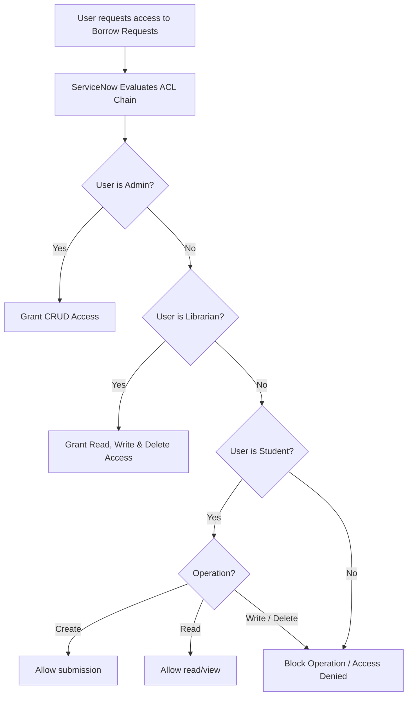

# Smart Library Request Workflow in ServiceNow
## Section 14: Access Control for Borrow Request Table Documentation

## 1. Objective
The objective of this task is to configure Access Control Lists (ACLs) for the Borrow Request (`u_borrow_request`) table. The ACLs ensure that students can create and view their borrow requests, while librarians have full control to read, update, and delete borrow request records. This role-based security protects borrowing information and prevents unauthorized modifications.

## 2. Introduction
Access Control Lists (ACLs) are used in ServiceNow to secure tables, records, and fields by controlling user permissions. They define who can Create, Read, Write, and Delete (CRUD) records based on assigned roles.

For the Borrow Request table:
* Students can create new borrow requests and read their submitted requests.
* Librarians can read, update, approve, reject, and delete borrow requests.
* Unauthorized users are prevented from accessing sensitive request information.

This configuration supports secure and efficient library operations.

---

## 3. Prerequisites
Before configuring ACLs, ensure that:
* ServiceNow Personal Developer Instance (PDI) is active.
* Administrator (`admin`) access is available.
* The Borrow Request (`u_borrow_request`) table has been created (via Task 6).
* The `student` (`x_library.student`) and `librarian` (`x_library.librarian`) roles are available (via Task 5).

---

## 4. Access Control Requirements

| Operation | Student Role (`x_library.student`) | Librarian Role (`x_library.librarian`) |
| :--- | :---: | :---: |
| **Create (submit)** | ✔ Allowed | ✘ Denied* |
| **Read (view)** | ✔ Allowed | ✔ Allowed |
| **Write (edit)** | ✘ Denied | ✔ Allowed |
| **Delete (remove)** | ✘ Denied | ✔ Allowed |

*\*Note: Librarians manage incoming records through the approval flow rather than inserting borrowing requests themselves. If needed, the Create ACL can be adjusted.*

---

## 5. Implementation Steps

### Step 1 – Open Access Control (ACL)
1. Log in to your ServiceNow instance.
2. Click **All** in the Application Navigator.
3. Search for **Access Control** or **ACL**.
4. Open **System Security** ──> **Access Control (ACL)**.

#### UI Mockup 1: Access Control Navigation
```
================================================================================
|  ServiceNow  |  Filter Navigator: [ Access Control ]  | User Profile (Admin) |
================================================================================
|  All | Favorites | History | Developer                                       |
--------------------------------------------------------------------------------
|  ▼ System Security                                                           |
|    * Access Control (ACL)  <=== (Select this to open the ACL list)            |
================================================================================
```
*Figure 1: Opening the Access Control (ACL) module.*

---

### Step 2 – Create Create ACL
1. Click the **New** button in the list header.
2. Configure the following fields:
   * **Type**: `record`
   * **Operation**: `create`
   * **Name**: `Borrow Request [u_borrow_request]` ──> `*`
3. Scroll to the **Requires role** related list.
4. Add role: `x_library.student`.
5. Click **Submit**.

#### Figure 2: Create ACL allowing Students to create borrow requests


---

### Step 3 – Create Read ACL
1. Click **New**.
2. Configure the following properties:
   * **Type**: `record`
   * **Operation**: `read`
   * **Name**: `Borrow Request [u_borrow_request]` ──> `*`
3. Add role requirement: `x_library.student` and `x_library.librarian`.
4. Click **Submit**.

#### UI Mockup 3: Read ACL Configuration
```
================================================================================
|  Access Control  |  New Record                                    [ Submit ] |
================================================================================
|  * Type:            [ record                                             |▼] |
|  * Operation:       [ read                                               |▼] |
|  * Name:            [ Borrow Request [u_borrow_request] |▼] [ *           |▼] |
--------------------------------------------------------------------------------
|  Requires Role:                                                              |
|  [+] x_library.student                                                       |
|  [+] x_library.librarian                                                     |
================================================================================
```
*Figure 3: Read ACL allowing Students and Librarians to view borrow requests.*

---

### Step 4 – Create Write ACL
1. Click **New**.
2. Configure:
   * **Type**: `record`
   * **Operation**: `write`
   * **Name**: `Borrow Request [u_borrow_request]` ──> `*`
3. Add role requirement: `x_library.librarian`.
4. Click **Submit**.

---

### Step 5 – Create Delete ACL
1. Click **New**.
2. Configure:
   * **Type**: `record`
   * **Operation**: `delete`
   * **Name**: `Borrow Request [u_borrow_request]` (Table level)
3. Add role requirement: `x_library.librarian`.
4. Click **Submit**.

---

## 6. ACL Permission Matrix

| User Role / Group | Create | Read | Write | Delete |
| :--- | :---: | :---: | :---: | :---: |
| **Student** (`student`) | ✔ | ✔ | ✘ | ✘ |
| **Librarian** (`librarian`) | ✘* | ✔ | ✔ | ✔ |
| **Admin** (`admin`) | ✔ | ✔ | ✔ | ✔ |

---

## 7. Access Control Workflow
The request lifecycle mapping checks user roles before resolving CRUD queries:


---

## 8. Testing Access Controls
Access checks are tested via **Impersonate User** on a PDI sandbox environment:

| Step | Action | Expected ServiceNow Behavior | Result | Verification |
| :--- | :--- | :--- | :--- | :---: |
| **1** | Student opens Service Portal | Can fill form; "Submit" button is visible. | Success | ✔ Pass |
| **2** | Student views borrow request | Form displays historical logs as read-only. | Success | ✔ Pass |
| **3** | Student attempts edit | Form input fields are disabled/locked. | Access denied | ✔ Pass |
| **4** | Student attempts delete | "Delete" button is hidden from form context. | Access denied | ✔ Pass |
| **5** | Librarian opens request queue| Form displays active requests in editable state. | Success | ✔ Pass |
| **6** | Librarian updates status | Request state updates (Approved/Rejected). | Success | ✔ Pass |
| **7** | Librarian clicks "Delete" | Record is removed and user is redirected. | Success | ✔ Pass |

#### Figure 6: Testing Borrow Request ACLs through user impersonation


---

## 9. Expected Outcome
After completing this task:
* Students can create borrow requests.
* Students can read their submitted requests.
* Librarians can read, update, and delete requests.
* Unauthorized users cannot modify borrow request records.
* Role-based security is successfully implemented.

## 10. Benefits
* **Secures Borrowing Records**: Shields personal student transactional metadata.
* **Prevents Unauthorized Modifications**: Stops students from tampering with the approval state.
* **Separates Student/Librarian Workflows**: Student focuses on request placement; librarian focuses on stock fulfillment.
* **Improves Data Integrity**: Preserves authentic transaction trails for library auditing.

## 11. Conclusion
The Access Control Lists configured for the Borrow Request (`u_borrow_request`) table ensure that borrowing records are protected through role-based security. Students are granted permissions to create and view their requests, while librarians can manage the complete lifecycle of borrow requests by updating or deleting records as needed. This implementation enhances application security, maintains data integrity, and supports an efficient and controlled library management process.
