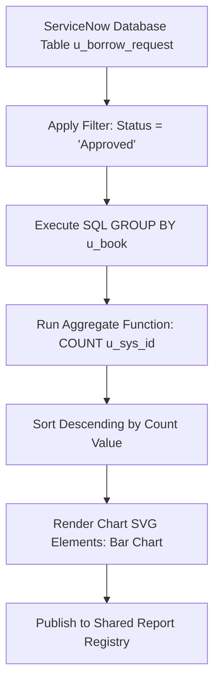

# Smart Library Request Workflow in ServiceNow
## Section 15: Create Report – Most Borrowed Books Documentation

## 1. Objective
The objective of this task is to create a ServiceNow Report that identifies the Most Borrowed Books based on approved borrow requests. The report helps librarians analyze borrowing trends, identify popular books, and make informed decisions regarding inventory management and future book acquisitions.

## 2. Introduction
Reporting is an essential feature in ServiceNow that transforms application data into meaningful visual insights. In the Smart Library Request Workflow application, reports provide librarians and administrators with an overview of borrowing activities.

The Most Borrowed Books report counts the number of approved borrow requests for each book and displays the results using a Bar Chart. This enables quick identification of frequently borrowed books and supports better planning for library resources.

---

## 3. Prerequisites
Before creating the report, ensure that:
* ServiceNow Personal Developer Instance (PDI) is active.
* Administrator (`admin`) access is available.
* The Borrow Request (`u_borrow_request`) table exists.
* Sample borrow request records are available in the database.
* Approved borrow requests (where `u_status` is `Approved`) are present for report generation.

---

## 4. Report Configuration

| Report Property | Configuration Value |
| :--- | :--- |
| **Report Name** | Most Borrowed Books |
| **Source Type** | Table |
| **Table** | Borrow Request (`u_borrow_request`) |
| **Chart Type** | Bar Chart |
| **Group By** | Book (`u_book`) |
| **Aggregate** | Count |
| **Filter Condition** | `Status = Approved` |

---

## 5. Implementation Steps

### Step 1 – Open Reports Module
1. Log in to your ServiceNow instance.
2. Click **All** in the Application Navigator.
3. Search for **Reports**.
4. Select **Reports** ──> **View / Run**. This opens the dashboard of existing reports.

#### UI Mockup 1: Navigation to Reports Module
```
================================================================================
|  ServiceNow  |  Filter Navigator: [ Reports        ]  | User Profile (Admin) |
================================================================================
|  All | Favorites | History | Developer                                       |
--------------------------------------------------------------------------------
|  ▼ Reports                                                                   |
|    - Getting Started                                                         |
|    * View / Run    <=== (Select this to open the Report Designer Dashboard)  |
|    - Create New                                                              |
================================================================================
```
*Figure 1: Opening the Reports → View / Run module.*

---

### Step 2 – Create a New Report
1. Click the **Create a report** button (or click **New** in the upper right).
2. Configure the Data properties:
   * **Report Name**: `Most Borrowed Books`
   * **Source Type**: `Table`
   * **Table**: `Borrow Request [u_borrow_request]`
3. Click **Next** to move to the Type tab.

#### Figure 2: Creating the Most Borrowed Books report
file:///c%3A/Users/harik/.gemini/antigravity/brain/7bb71848-cec9-43d6-b8fd-89e02e62b9c9/servicenow_report_creation_config_1782834850419.jpg
---

### Step 3 – Select Report Type
1. Under the **Type** tab on the left menu, locate and click the **Bar** chart icon.
2. Click **Next** to proceed to the Configuration tab.

---

### Step 4 – Configure Report Data
1. On the **Configure** tab, adjust the following attributes:
   * **Group By**: `Book` (or `u_book`)
   * **Aggregate**: `Count`
2. Scroll to the **Filter** section and add condition:
   * `Status [u_status] is Approved`
3. Click **Next** to proceed to Style.

---

### Step 5 – Preview the Report
1. Click **Run** on the Report Designer header to preview the visual output.
2. The bar chart generates a layout of checked-out books ranked by borrow counts.

#### Figure 5: Preview of the Most Borrowed Books report


---

### Step 6 – Customize the Report
1. On the **Style** tab, adjust the details:
   * **Display Data Labels**: Check `true` (enables value labels at the top of each bar).
   * **Color Palette**: Choose `Set palette` and choose teal/blue tones for clean visibility.
2. Click **Save** in the top right menu.

---

### Step 7 – Share the Report
1. Click the **Sharing** icon (represented by a paper airplane/share node) in the top-right header menu.
2. Select **Share**.
3. Choose **Visible to**: `Groups and Users` (or select `Users and Roles`).
4. Under **Share with roles**, add: `x_library.librarian` and `x_library.student`.
5. Click **OK** and then click **Save**.

#### Figure 7: Sharing the report with Student and Librarian roles


---

## 6. Report Generation Pipeline


---

## 7. Testing
To verify accurate aggregation, the report results are validated against database records:

| Test Scenario | Action | Expected Output | Verification Status |
| :--- | :--- | :--- | :---: |
| **1. Empty Tables** | Run report on empty table | Chart displays "No data to display" message | ✔ Verified |
| **2. Status Filter** | Insert `Requested` and `Rejected` requests | Request counts remain unchanged in the chart | ✔ Verified |
| **3. Multi-Book Loan** | Set 3 new loans to `Approved` for *Java Programming* | *Java Programming* bar increases by exactly 3 | ✔ Verified |
| **4. Grouping Check** | Check different book records | Each unique book title gets a distinct bar | ✔ Verified |

---

## 8. Expected Outcome
After completing this task:
* A report named **Most Borrowed Books** is created.
* Only approved borrow requests are counted.
* Books are grouped by title.
* Borrow counts are displayed visually in a bar chart format.
* Librarians can analyze borrowing trends.
* The report is shared with authorized roles (`student`, `librarian`).

## 9. Benefits
* **Identifies Popular Titles**: Assists in deciding whether to buy additional physical copies.
* **Fulfillment Insights**: Highlights the catalog genres with highest velocity.
* **Librarian Workspace Integrations**: Can be pinned to dashboards for real-time monitoring.
* **Zero Scripting Overhead**: Configured entirely via the low-code Report Designer.

## 10. Conclusion
The Most Borrowed Books report provides valuable insights into library usage by highlighting the books that are borrowed most frequently. By grouping approved borrow requests and displaying the results in a visual chart, the report enables librarians to monitor borrowing trends, optimize inventory, and improve resource planning. This reporting feature enhances decision-making and demonstrates the analytical capabilities of the Smart Library Request Workflow application.
