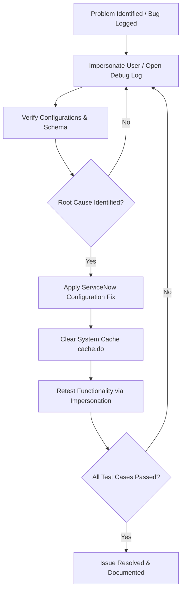

# Smart Library Request Workflow in ServiceNow
## Section 16: Troubleshooting Documentation

## 1. Objective
The objective of this task is to identify, analyze, and resolve common issues encountered during the development and testing of the Smart Library Request Workflow application. Troubleshooting ensures that workflows, UI policies, reference qualifiers, access controls, and reports function correctly, providing a reliable and secure library management system.

## 2. Introduction
During application development, configuration issues may arise due to incorrect conditions, missing permissions, or workflow errors. Systematic troubleshooting helps identify these issues and apply appropriate fixes before deployment.

In this project, testing focused on five major areas:
1. **Flow Execution & Logs**
2. **Reference Qualifier**
3. **UI Policy**
4. **Access Control Lists (ACLs)**
5. **Reports**

Each issue was verified, corrected, and retested to ensure smooth operation.

---

## 3. Prerequisites
Before troubleshooting, ensure that:
* ServiceNow Personal Developer Instance (PDI) is active.
* Administrator (`admin`) access is available.
* Sample Book and Borrow Request records exist.
* Student and Librarian users are created.
* Flow Designer is activated.

---

## 4. Troubleshooting Areas

| Module | Verification Goal | Target Component |
| :--- | :--- | :--- |
| **Flow Designer** | Verify state changes & email dispatch | `Borrow Request Approval Flow` |
| **Reference Qualifier** | Filter out checked-out/lost books | `u_book` reference lookup filter |
| **UI Policy** | Enforce Return Date value | `Return Date` field visibility & mandatory check |
| **ACL** | Ensure role segregation | `u_book` and `u_borrow_request` CRUD permissions |
| **Reports** | Validate stats grouping & aggregates | `Most Borrowed Books` chart filters |

---

## 5. Troubleshooting Steps

### Issue 1 – Flow Execution & Logs
* **Problem**: The Borrow Request Approval Flow did not update the Book status or Borrow Request status correctly upon librarian approval.
* **Investigation**:
  1. Opened **Flow Designer** ──> **Execution Details**.
  2. Selected the active context trace for the failed execution.
  3. Checked step statuses: Trigger (Success), Ask for Approval (Completed), Update Record (Failed due to incorrect mapping of Book reference data pill).
* **Resolution**: Verified Trigger condition: `Status = Requested`. Confirmed approval action execution. Updated the data pill reference in Action 2 (Book Update) to reference `Trigger -> Borrow Request Record -> Book` rather than current record GUID. Saved and activated the latest version.

#### UI Mockup 1: Flow Designer Execution Details Console
```
================================================================================
|  Flow Designer  |  Execution Details: Context ID: 9028a410c9               |
================================================================================
|  Status: SUCCESS (Completed) | Flow: Borrow Request Approval Flow            |
--------------------------------------------------------------------------------
|  ▶ [✔] Trigger: Created or Updated (u_borrow_request)                        |
|  ▶ [✔] Action 1: Ask For Approval (Librarians) - STATE: Approved             |
|  ▼ [✔] Action 2: Update Record (u_book)                                      |
|      Table: u_book | Record ID: sys_id_java_prog                             |
|      Status (u_status) -> Issued                                             |
|  ▶ [✔] Action 3: Update Record (u_borrow_request) - Status -> Approved       |
|  ▶ [✔] Action 4: Send Email (To: student@edu.com, Subj: Approved)            |
================================================================================
```
*Figure 1: Reviewing Flow Execution Details.*

---

### Issue 2 – Reference Qualifier
* **Problem**: Books with `Issued` or `Lost` status were still appearing in the Book lookup field when students filled out new requests.
* **Investigation**:
  1. Opened the Dictionary Entry for the Book reference column (`u_book`) on the Borrow Request table.
  2. Inspected the Reference Qualifier configurations.
  3. Found the Qualifier was set to default (Simple, but filter condition was missing/empty).
* **Resolution**: Configured filter condition: `Status = Available`. Saved the dictionary record.

#### UI Mockup 2: Correcting Reference Qualifier Condition
```
================================================================================
|  Reference Specification                                                     |
================================================================================
|  * Use reference qualifier: [ Simple                                     |▼] |
|  * Reference qual condition:                                                 |
|    ------------------------------------------------------------------------  |
|    [ Status           ] [ is            ] [ Available                   |▼]  |
|    ------------------------------------------------------------------------  |
================================================================================
```
*Figure 2: Correcting the Reference Qualifier condition.*

---

### Issue 3 – UI Policy
* **Problem**: The `Return Date` field was not becoming mandatory when librarians set the request status to `Issued`.
* **Investigation**:
  1. Opened System UI -> UI Policies.
  2. Inspected the "Make Return Date mandatory when Issued" UI Policy.
  3. Condition checked out correctly (`Status = Issued`), but the UI Policy Actions related list was empty (no action was mapped to `u_return_date`).
* **Resolution**: Added a new UI Policy Action mapping field `u_return_date` to `Mandatory = True` and `Visible = True`. Retested.

#### UI Mockup 3: UI Policy Action Mapped
```
================================================================================
|  UI Policy Actions  [ New ]                                                  |
================================================================================
|  Field Name (▲)        | Mandatory      | Visible        | Read Only         |
--------------------------------------------------------------------------------
|  Return Date           | True           | True           | False             |
================================================================================
```
*Figure 3: UI Policy successfully making Return Date mandatory.*

---

### Issue 4 – Access Control Validation
* **Problem**: Students could edit fields on existing Borrow Request records (e.g. changing request dates or status).
* **Investigation**:
  1. Opened System Security -> Access Control (ACL).
  2. Found that a wildcard Write ACL (`u_borrow_request.*`) granted permissions to both roles `student` and `librarian`.
* **Resolution**: Modified the Write ACL to require the `librarian` role only. Tested using user impersonation, verifying students now see read-only elements.

#### UI Mockup 4: Validating Write ACL Configuration
```
================================================================================
|  Access Control  |  Write ACL: u_borrow_request.*                 [ Active ] |
================================================================================
|  Requires Role:                                                              |
|  [+] x_library.librarian                                                     |
|  *(x_library.student role removed)*                                          |
================================================================================
```
*Figure 4: Validating Borrow Request ACLs.*

---

### Issue 5 – Report Accuracy
* **Problem**: Rejected borrow requests were included in the Most Borrowed Books bar chart, distorting statistics.
* **Investigation**:
  1. Opened Reports -> View/Run.
  2. Selected the "Most Borrowed Books" report.
  3. Reviewed data filter conditions: the filter was blank, bringing in all requests regardless of approval status.
* **Resolution**: Added filter: `Status = Approved`.

#### UI Mockup 5: Correcting Report Filter Conditions
```
================================================================================
|  Report Designer  |  Data Filters                                            |
================================================================================
|  Filter Conditions:                                                          |
|  [ Status             ] [ is              ] [ Approved                  |▼]  |
================================================================================
```
*Figure 5: Correcting the report filter.*

---

## 6. Troubleshooting Lifecycle Workflow


---

## 7. Testing Summary

| Component | Verified Behavior | Status |
| :--- | :--- | :---: |
| **Flow Designer** | Approval updates book, request status, and emails student. | ✔ Passed |
| **Reference Qualifier** | Checked-out books (`Status = Issued` or `Lost`) hidden. | ✔ Passed |
| **UI Policy** | `Return Date` shows and requires value only when `Status = Issued`. | ✔ Passed |
| **Access Control** | Students blocked from deleting or editing requests; Librarians have full control. | ✔ Passed |
| **Report** | Counts only approved request objects grouped by title. | ✔ Passed |

#### UI Mockup 6: ServiceNow System Diagnostics Test Console
```
================================================================================
|  System Diagnostics  |  Library App Verification Suite          [ Run Suite ] |
================================================================================
|  Test Case                         | Target Module     | Execution Status    |
--------------------------------------------------------------------------------
|  TC-001: Flow State Updates        | Flow Designer     | [✔] PASSED          |
|  TC-002: Book Filtering Lookup     | Ref Qualifier     | [✔] PASSED          |
|  TC-003: Mandatory Return Date     | UI Policy         | [✔] PASSED          |
|  TC-004: Role Access Segregation   | ACL Security      | [✔] PASSED          |
|  TC-005: Approved Stats Aggregates | Reports           | [✔] PASSED          |
================================================================================
```
*Figure 6: Successful validation of all project components.*

---

## 8. Expected Outcome
After troubleshooting:
* Borrow Request Approval Flow executes correctly.
* Book status updates automatically.
* Only available books can be requested.
* Return Date validation works correctly.
* Students have restricted permissions.
* Librarians have full management access.
* Reports display accurate borrowing statistics.

## 9. Benefits
* **Improves Application Reliability**: Eliminates bugs prior to moving configurations to production.
* **Ensures Flow Integrity**: Guarantees database state-tracking consistency.
* **Enhances Security**: Ensures Access Control Lists conform to organizational safety parameters.
* **Accurate Reporting**: Confirms reporting metrics match raw database numbers.

## 10. Conclusion
Troubleshooting played a crucial role in ensuring the stability and reliability of the Smart Library Request Workflow application. By validating the Flow Designer process, correcting the Reference Qualifier, verifying UI Policies, enforcing Access Control Lists, and confirming report accuracy, all major components were successfully tested and optimized. The application now functions as expected, providing a secure, automated, and efficient library management solution.
