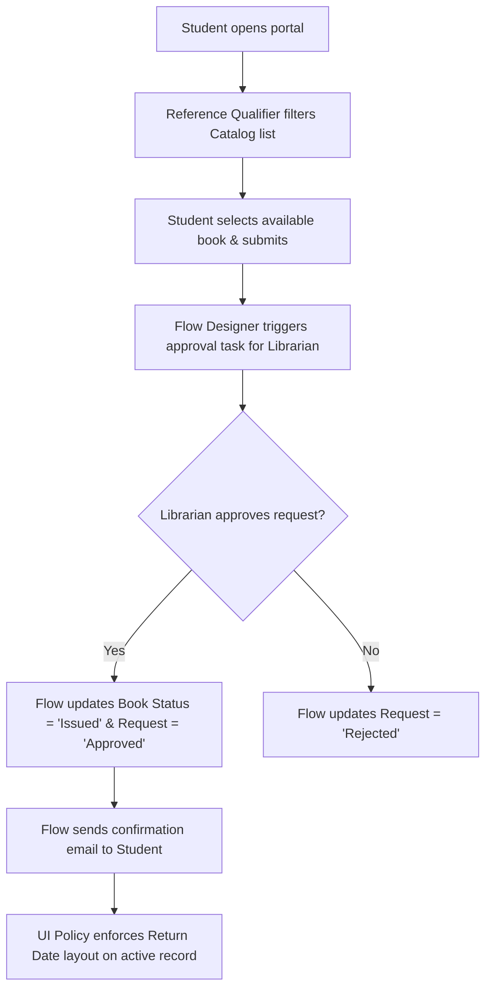

# Smart Library Request Workflow in ServiceNow
## Section 18: Innovation Documentation

## 1. Objective
The objective of this task is to highlight the innovative features implemented in the Smart Library Request Workflow project. These enhancements leverage ServiceNow's out-of-the-box (OOTB) capabilities to automate library operations, improve user experience, reduce manual effort, and build a scalable solution that can easily accommodate future enhancements.

## 2. Introduction
Innovation in application development focuses on improving efficiency, reliability, and user satisfaction through intelligent automation and streamlined processes. Instead of relying on manual tracking and paper-based approvals, the Smart Library Request Workflow uses ServiceNow's built-in tools to create a modern digital library management system.

Key innovations include automated approvals, intelligent book filtering, dynamic user interfaces, role-based security, and reporting dashboards that simplify daily library operations.

---

## 3. Innovation Overview

| Innovation Area | Description | ServiceNow Out-of-the-box Feature |
| :--- | :--- | :--- |
| **End-to-End Automation** | Automated borrow request approval and book issuance logic. | Flow Designer |
| **Optimized Request Handling** | Prevented requests for unavailable books via filter enforcement. | Reference Qualifiers |
| **Maintainability & Scalability** | Low-code implementation to support rapid system changes. | Custom Tables & Configurations |
| **User Experience (UX)** | Dynamic form configurations reducing field clutter. | UI Policies |

---

## 4. Innovative Features Implemented

### Innovation 1 – End-to-End Automation
The borrowing process has been fully automated using Flow Designer, replacing paper signatures and manual email tracking with state-driven actions.
* **Flow Details**: Student submits a borrow request (triggers flow) ──> Librarian reviews approval task ──> Book status updates to `Issued` ──> Request status updates to `Approved` ──> SMTP notification is sent to the student automatically.

#### UI Mockup 1: Flow Designer Workflow Summary Canvas
```
================================================================================
|  Flow Canvas View: Borrow Request Approval Flow                              |
================================================================================
|  Trigger: Created/Updated [u_borrow_request] where Status == 'Requested'      |
|  Action 1: Ask For Approval (Librarian User Group)                            |
|  Decision: If Approved                                                       |
|     ├── Action 2: Update Book Record (Status = Issued)                       |
|     ├── Action 3: Update Borrow Request Record (Status = Approved)           |
|     └── Action 4: Send Email Notification (To: Student, Subj: Approved)      |
================================================================================
```
*Figure 1: Automated Borrow Request Approval Flow.*

---

### Innovation 2 – Optimized Request Handling
Implemented Reference Qualifiers to filter lookup fields, preventing duplicate requests for checked-out or lost books.
* **Configuration**: A Reference Qualifier on the Book lookup field restricts options to `Status = Available`. Students never see unfulfillable items.

#### UI Mockup 2: Advanced Reference Qualifier Configuration
```
================================================================================
|  Reference Specification (Book Field)                                        |
================================================================================
|  * Use reference qualifier: [ Simple                                     |▼] |
|  * Reference qual condition:                                                 |
|    ------------------------------------------------------------------------  |
|    [ Status           ] [ is            ] [ Available                   |▼]  |
|    ------------------------------------------------------------------------  |
================================================================================
```
*Figure 2: Reference Qualifier displaying only available books.*

---

### Innovation 3 – Maintainability & Scalability
The application was developed using standard ServiceNow components instead of custom scripts wherever possible. This ensures compatibility with future ServiceNow upgrades (e.g. Washington, Xanadu releases).
* **Components Configured**: Custom Tables, Flow Designer, UI Policies, Access Control Lists (ACLs), Reports.

#### Figure 3: ServiceNow custom tables demonstrating modular database layout


---

### Innovation 4 – User Experience Enhancements
Dynamic form controls improve usability for both students and librarians by displaying and requiring fields only when contextually relevant.
* **Policy Configured**: When `Status = Issued`, set `Return Date` field to `Mandatory = True` and `Visible = True`.

#### UI Mockup 4: UI Policy Action enforcing Return Date mandatory status
```
================================================================================
|  UI Policy Action: Return Date                                               |
================================================================================
|  * Field name:  [ u_return_date                                          |▼] |
|    Mandatory:   [ True                                                   |▼] |
|    Visible:     [ True                                                   |▼] |
|    Read Only:   [ False                                                  |▼] |
================================================================================
```
*Figure 4: Dynamic UI Policy improving the user experience.*

---

## 5. Innovation Workflow


---

## 6. Innovation Summary: Traditional vs. Implemented

| Operational Area | Traditional Library Process | Implemented Solution |
| :--- | :--- | :--- |
| **Borrow Request** | Paper forms / Manual spreadsheet updates | State-driven database inserts |
| **Book Selection** | Manual stock check on shelves | Reference Qualifier filtered lookups |
| **Request Approvals** | Email chains or manual manager signatures | Automated Flow Designer tasks |
| **System Security** | Visual file checks / Trust-based access | Role-Based Access Control Lists (ACLs) |
| **User Forms** | Static layouts showing blank irrelevant inputs | Dynamic UI Policies |
| **Reporting** | Manual spreadsheet tallying at month-end | Automated real-time Bar Charts |

---

## 7. Benefits of the Innovative Solution
* **Fully Automated Borrowing Process**: Streamlines transaction times.
* **Reduced Manual Workload**: Eliminates paper sign-offs and copy updates.
* **Data-driven Resource Planning**: Analytics dashboards guide future book purchases.
* **Robust Security Configuration**: Enforces role access profiles out-of-the-box.
* **Upgrade-safe Application Architecture**: Lower maintenance cost through OOTB low-code components.

## 8. Expected Outcome
After implementing these innovations:
* Library operations become faster and more efficient.
* Students experience a simple and user-friendly borrowing process.
* Librarians spend less time on repetitive administrative tasks.
* Data remains accurate and secure.
* The application is ready for future enhancements such as email reminders, overdue notifications, dashboards, and self-service portals.

## 9. Conclusion
The Smart Library Request Workflow demonstrates innovation by combining ServiceNow's standard capabilities to automate and optimize library management. End-to-end workflow automation, intelligent book filtering through Reference Qualifiers, dynamic UI Policies, and role-based security collectively improve operational efficiency and user experience. By using maintainable and scalable ServiceNow features, the solution is well-positioned for future enhancements while reducing development complexity and administrative effort.
