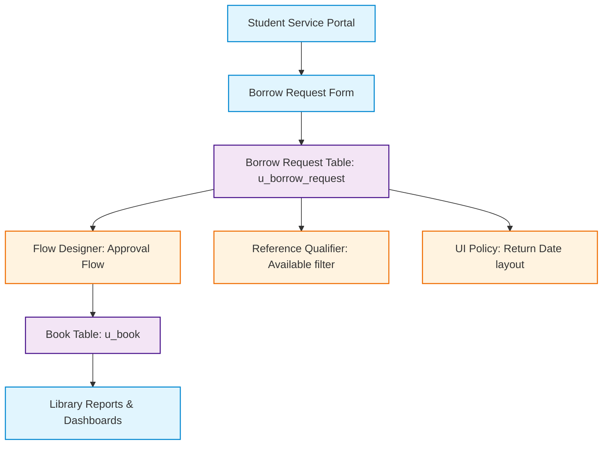

# Smart Library Request Workflow in ServiceNow
## Section 19: Technical Blueprint Documentation

## 1. Objective
The objective of this task is to prepare the Technical Blueprint for the Smart Library Request Workflow application. This document provides a high-level overview of the application's architecture, data model, variables, workflows, approval process, fulfillment tasks, and automation logic. It serves as a reference for developers, administrators, and future maintenance of the application.

## 2. Introduction
The Smart Library Request Workflow is developed using the ServiceNow platform to automate the library book borrowing process. The application uses custom tables, role-based access control (RBAC), Flow Designer, UI Policies, Reference Qualifiers, and Reports to streamline library operations.

The technical blueprint explains how each component interacts to deliver a secure, scalable, and automated workflow.

---

## 3. System Architecture
The application runs as a modular solution on the ServiceNow cloud, binding a client-facing portal to back-end databases:

*Figure 1: Smart Library Request Workflow architecture diagram.*

---

## 4. Database Design

### Book Table (`u_book`)
Stores metadata representing the physical inventory of library materials.
* **Title** (`u_title`): String
* **Author** (`u_author`): String
* **ISBN** (`u_isbn`): String
* **Status** (`u_status`): Choice (`Available`, `Issued`, `Lost`)

### Borrow Request Table (`u_borrow_request`)
Tracks active checkouts, history, and approval stages.
* **Requested By** (`u_requested_by`): Reference (`sys_user`)
* **Book** (`u_book`): Reference (`u_book`)
* **Request Date** (`u_request_date`): Date/Time
* **Return Date** (`u_return_date`): Date/Time
* **Status** (`u_status`): Choice (`Requested`, `Approved`, `Rejected`, `Issued`, `Returned`)

#### Figure 2: Custom tables verification in ServiceNow System Dictionary


---

## 5. Variables & Form Layouts
The client-facing Borrow Request form collects details using specific variables:

| Variable Label | Type | ServiceNow Source / Behavior |
| :--- | :--- | :--- |
| **Book** | Reference | Displays catalog list; filtered dynamically by reference qualifier |
| **Requested By** | Reference | Defaults to current login (`gs.getUserID()`); editable for delegate requests |
| **Request Date** | Date/Time | Automatically populates with submission timestamp |
| **Return Date** | Date/Time | Mandatory and visible only when transaction Status = `Issued` |
| **Status** | Choice | Default = `Requested` |

#### Figure 3: Borrow Request form variable verification in ServiceNow UI


---

## 6. Approval Use Cases
The flow engine implements specific approval tracks:

### Use Case 1: Student Borrow Request
1. Student submits a request (`u_status = Requested`).
2. Flow Designer creates a Librarian approval record.
3. If Librarian clicks **Approve**:
   * Book status shifts to `Issued`.
   * Request status shifts to `Approved`.
   * Flow fires SMTP email notification to Student.
4. If Librarian clicks **Reject**:
   * Request status shifts to `Rejected`.

### Use Case 2: Librarian Borrow Request (Autocheckout)
1. Librarian submits a request.
2. The system triggers auto-approval.
3. Book status immediately shifts to `Issued`, and request status is logged as `Approved`.

#### UI Mockup 4: Flow Designer Approval Step Configuration
```
================================================================================
|  Action 1: Ask For Approval                                                  |
================================================================================
|  Record:      [ Trigger - Borrow Request Record                           ]  |
|  Rules:       [ Anyone approves                                          |▼] |
|  Approver:    [ Users with role: x_library.librarian                      ]  |
================================================================================
```
*Figure 4: Approval workflow configuration.*

---

## 7. Fulfillment Task Use Cases

### Task 1 – Issue Book
Upon approval:
1. ServiceNow creates a Catalog Task (`sc_task`) assigned to the **Librarian Group**.
2. Librarian retrieves physical book from shelf (guided by Rack Management data).
3. Librarian clicks **Complete Task**.
4. The system updates the Borrow Request status to `Issued` and Book status to `Issued`.

### Task 2 – Return Book
Upon physical check-in:
1. Student returns book to counter.
2. Librarian opens active Borrow Request and sets **Status** to `Returned`.
3. Flow triggers update on corresponding Book record, resetting **Status** to `Available`.

#### UI Mockup 5: Task Fulfillment States
```
================================================================================
|  Librarian counter task console                                             |
================================================================================
|  Task: SC0002048 | Retrieve book from Shelf: RACK-04-A                      |
|  Assignee: Librarian Group                      |  Status: [ Close Complete ]|
================================================================================
```
*Figure 5: Book issue and return process.*

---

## 8. Workflow Logic
```
[Student Request]
       │
       ▼
[Ref Qualifier (Filter status=Available)]
       │
       ▼
[Trigger Approval Flow]
       │
  Librarian Approval?
   ├── Yes ──> [Create Catalog Task] ──> [Issue Book] ──> [Request = Issued] ──> [Book Returned] ──> [Request = Returned]
   └── No  ──> [Request = Rejected]
```

---

## 9. Security Design
Role-Based Access Control is enforced through system tables, reference parameters, and client rules:

| Technology Element | Security Mechanism | Scope |
| :--- | :--- | :--- |
| **Book Table** | Access Control List (ACL) | Read (Student & Librarian), Create/Write/Delete (Librarian only) |
| **Borrow Request Table** | Access Control List (ACL) | Create/Read (Student), Read/Write/Delete (Librarian only) |
| **Book Selector** | Reference Qualifier | Filters lookup queries to available records, blocking unauthorized select |
| **Dynamic Form Layout** | UI Policy | Enforces Return Date entry at browser layout level |

#### Figure 6: Custom ACL security configuration for Borrow Request table


---

## 10. Reporting
Dashboard analytics compile transactional updates into visible chart formats.
* **Aggregations**: Groups records by `Book` reference, applying filters `Status = Approved`. Displays results in a Bar Chart.

#### Figure 7: Most Borrowed Books bar chart report dashboard view


---

## 11. Technical Components Summary

| Component | ServiceNow Engine | Purpose |
| :--- | :--- | :--- |
| **Tables** | custom database engine | Data schema definition |
| **Forms** | Form Layout Designer | User input mapping |
| **Workflow** | Flow Designer | Task automation |
| **Security** | System Security ACLs | Encryption and role protection |
| **UI Controls** | UI Policies | Form field visibility and behaviors |
| **Filtering** | Reference Qualifiers | Data visibility checks |
| **Reporting** | Report Designer | Visual metrics and charts |
| **Notifications** | Email Engine | Outbound email templates |

---

## 12. Expected Outcome
After completing the technical blueprint:
* System architecture is documented.
* Database structure is clearly defined.
* Variables and workflows are explained.
* Approval and fulfillment processes are documented.
* Security model is specified.
* Future maintenance becomes easier.

## 13. Benefits
* **Complete System Documentation**: Acts as a comprehensive system guide.
* **Simplified Maintenance**: Reduces debugging steps for platform administrators.
* **Upgrade Safety**: Documents use of Low-Code tools, guaranteeing clean upgrades.
* **Knowledge Transfer**: Speeds up onboarding of new developers or maintenance crews.

## 14. Conclusion
The Technical Blueprint serves as a comprehensive reference for the Smart Library Request Workflow application. It documents the architecture, database design, variables, workflow automation, approval logic, fulfillment tasks, security model, and reporting features. By consolidating these technical details into a single document, the blueprint ensures easier maintenance, smoother deployment, and better scalability for future enhancements.
