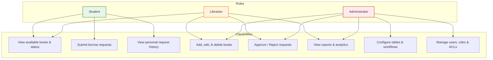

# Smart Library Request Workflow in ServiceNow
## Section 2: Functional Scope Documentation

## 1. Introduction
The Functional Scope defines the major features and functionalities that will be implemented in the Smart Library Request Workflow project. It establishes the boundaries of the system by identifying what the application will perform for its users. The system is designed to automate library operations using the ServiceNow platform, allowing students and librarians to perform their respective tasks through a secure, workflow-driven environment.

The project focuses on simplifying book management, automating borrow request processing, implementing role-based access control, and generating reports for better library administration. By clearly defining the functional scope, the development process becomes structured and ensures that all business requirements are addressed.

## 2. Functional Scope Overview
The Smart Library Request Workflow consists of five major functional modules:
1. **Book Management**
2. **Borrow Request Management**
3. **Workflow Automation**
4. **Role-Based Access Control**
5. **Reporting and Analytics**

### Figure 1: Functional overview of the Smart Library Request Workflow in ServiceNow

```mermaid
graph TD
    System[Smart Library Request Workflow]
    
    %% Modules
    BookMgmt[Book Management]
    BorrowMgmt[Borrow Request Management]
    WorkflowAuto[Workflow Automation]
    RBAC[Role-Based Access Control]
    Reporting[Reporting & Analytics]
    
    System --> BookMgmt
    System --> BorrowMgmt
    System --> WorkflowAuto
    System --> RBAC
    System --> Reporting
    
    %% Book Management Features
    BookMgmt --> F1[Add/Edit/Delete Books]
    BookMgmt --> F2[Track Book Status]
    BookMgmt --> F3[Author & Publisher Index]
    
    %% Borrow Request Features
    BorrowMgmt --> F4[Create Borrow Requests]
    BorrowMgmt --> F5[Track Approval Status]
    BorrowMgmt --> F6[Request Lifecycle History]
    
    %% Workflow Automation features
    WorkflowAuto --> F7[Verify Availability]
    WorkflowAuto --> F8[Automated Status Updates]
    WorkflowAuto --> F9[Student & Librarian Notifications]
    
    %% RBAC features
    RBAC --> F10[Student Portal]
    RBAC --> F11[Librarian Console]
    RBAC --> F12[Admin System Settings]
    
    %% Reporting features
    Reporting --> F13[Borrow Statistics]
    Reporting --> F14[Inventory Reporting]
    Reporting --> F15[Real-time Dashboards]
    
    classDef default fill:#f9f9f9,stroke:#333,stroke-width:1px;
    classDef main fill:#005A9C,stroke:#002A54,stroke-width:2px,color:#fff;
    classDef module fill:#e1f5fe,stroke:#0288d1,stroke-width:1.5px;
    class System main;
    class BookMgmt,BorrowMgmt,WorkflowAuto,RBAC,Reporting module;
```


---

## 3. Functional Modules

### 3.1 Book Management
The Book Management module enables librarians to maintain the complete inventory of books available in the library. It acts as the central repository where all book-related information is stored and managed.

#### Features
* Add new books.
* Update existing book details.
* Delete obsolete book records.
* Maintain author and publisher information.
* Track book availability.
* Monitor issued and returned books.
* Update lost or damaged book status.

#### Book Status Values
* **Available**: In library inventory and open for borrowing.
* **Issued**: Checked out by a student.
* **Returned**: Book returned and pending inspection.
* **Lost**: Reported missing or unreturned; initiates catalog reconciliation.

#### Benefits
* Centralized inventory management.
* Accurate tracking of books.
* Easy maintenance of library records.
* Real-time availability information.

---

### 3.2 Borrow Request Management
Students can request books through a self-service interface. Every request is recorded in the system and processed by the librarian. The module maintains the complete lifecycle of every borrow request.

#### Features
* Create borrow requests.
* View request history.
* Track approval status.
* Cancel pending requests.
* Close completed requests.

#### Request Status Values
* **Requested**: Submitted by the student, awaiting validation.
* **Pending Approval**: Currently assigned to the librarian for approval.
* **Approved**: Request accepted, book allocated for pickup.
* **Rejected**: Request declined (e.g., student has overdue books).
* **Closed**: Book received back and loan transaction concluded.

#### Benefits
* Eliminates manual request forms.
* Improves request visibility.
* Faster processing.
* Accurate request tracking.

### Figure 2: Book request and approval process
```mermaid
sequenceDiagram
    autonumber
    actor Student as Student
    participant SN as ServiceNow Flow
    actor Librarian as Librarian
    database DB as Inventory Database
    
    Student->>SN: Submit Borrow Request
    activate SN
    SN->>DB: Check Book Availability
    alt Book is Available
        DB-->>SN: Available
        SN->>Librarian: Notify & Assign Approval Task
        activate Librarian
        Librarian-->>SN: Approve Request
        deactivate Librarian
        SN->>DB: Update Book Status to 'Issued'
        SN->>DB: Log Borrow Transaction
        SN->>Student: Send Confirmation Email
    else Book is Not Available
        DB-->>SN: Not Available
        SN->>Student: Send "Book Not Available" Notification
        SN->>SN: Cancel/Close Request (Status: Closed)
    end
    deactivate SN
```

---

### 3.3 Workflow Automation
One of the major functionalities of this project is workflow automation using ServiceNow Flow Designer. Whenever a student submits a borrow request, the workflow automatically performs predefined actions without requiring manual intervention.

#### Automated Functions
* Verify book availability.
* Notify librarian.
* Process approval.
* Update book status.
* Notify student.
* Record request history.
* Close completed requests.

#### Workflow Sequence
```
[Student Request] ──> [Availability Check] ──> [Librarian Approval] ──> [Book Status Updated] ──> [Student Notification] ──> [Request Closed]
```

#### Benefits
* Reduces manual effort.
* Faster approvals.
* Improves consistency.
* Prevents duplicate processing.
* Enhances operational efficiency.

---

### 3.4 Role-Based Access Control
The application uses ServiceNow Roles and Access Control Lists (ACLs) to provide secure access. Each user performs only the operations permitted by their assigned role.

* **Student Role**:
  * *Can*: View available books, submit borrow requests, view request history, and track request status.
  * *Cannot*: Modify books, approve requests, delete records, or access reports.
* **Librarian Role**:
  * *Can*: Add, edit, or delete books; approve or reject requests; update book status; and view reports.
* **Administrator Role**:
  * *Can*: Configure tables, create workflows, manage users, assign roles, configure ACLs, maintain reports, and manage system settings.

### Figure 3: Role-based access control for students, librarians, and administrators


---

### 3.5 Reporting and Analytics
The Reporting module provides graphical and tabular reports that help librarians analyze library usage and make informed decisions.

#### Available Reports
* **Most Borrowed Books**: Identifies high-demand titles.
* **Available Books**: Highlights current active inventory.
* **Issued/Returned/Lost Books**: Tracks active transactions and exceptions.
* **Pending Requests**: Unprocessed queue indicators.
* **Monthly Borrow Statistics**: Analyzes seasonal usage patterns.
* **Student Borrow History**: Reviews individual student profiles.

#### Benefits
* Better resource planning.
* Improved inventory management.
* Data-driven decision making.
* Easy monitoring of library activities.

### Figure 4: Reporting and analytics dashboard concept
```mermaid
graph TD
    Dashboard[ServiceNow Library Analytics Dashboard]
    
    subgraph KPI Widgets
        W1[Total Available Books: Count]
        W2[Active Loans: Count]
        W3[Pending Approvals: Gauge]
        W4[Overdue Books: Alert Count]
    end
    
    subgraph Data Visualizations
        V1[Bar Chart: Most Borrowed Books]
        V2[Pie Chart: Book Status Distribution]
        V3[Line Chart: Monthly Borrowing Trends]
    end
    
    subgraph Data Tables
        T1[List: Upcoming Returns]
        T2[List: Lost/Damaged Book Logs]
    end

    Dashboard --> KPI Widgets
    Dashboard --> Data Visualizations
    Dashboard --> Data Tables
    
    classDef kpi fill:#efebe9,stroke:#4e342e,stroke-width:1.2px;
    classDef viz fill:#e0f2f1,stroke:#00695c,stroke-width:1.2px;
    classDef tbl fill:#f3e5f5,stroke:#4a148c,stroke-width:1.2px;
    class W1,W2,W3,W4 kpi;
    class V1,V2,V3 viz;
    class T1,T2 tbl;
```

---

## 4. Functional Scope Summary
The Smart Library Request Workflow provides an integrated platform that combines inventory management, request processing, workflow automation, secure user access, and reporting into a single ServiceNow application. The system minimizes manual intervention while ensuring efficient management of library resources and improving the overall user experience.

## 5. Expected Outcome
After implementing the functional scope, the system will enable:
* Efficient management of library books.
* Online submission and tracking of borrow requests.
* Automated approval workflows.
* Secure access through user roles.
* Accurate reporting and analytics.
* Improved operational efficiency.
* Enhanced transparency in the borrowing process.

## 6. Advantages
* Fully automated library management.
* Centralized book database.
* Faster request processing.
* Real-time inventory updates.
* Secure role-based access.
* Workflow-driven approvals.
* Comprehensive reporting.
* Reduced paperwork.
* Improved user satisfaction.
* Better utilization of library resources.

## 7. Conclusion
The Functional Scope of the Smart Library Request Workflow clearly defines the features that will be implemented using the ServiceNow platform. The project integrates book management, borrow request processing, workflow automation, secure role-based access, and reporting into a unified solution. These functionalities improve operational efficiency, reduce manual effort, and provide a better experience for both students and librarians. The defined scope serves as the foundation for the subsequent development, configuration, testing, and deployment phases of the project.
