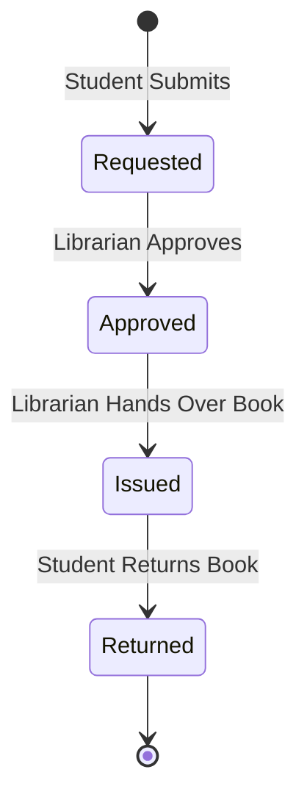

# Smart Library Request Workflow in ServiceNow
## Section 22: Visual Demonstration Documentation

## 1. Objective
The objective of this task is to visually demonstrate the major functionalities of the Smart Library Request Workflow application using screenshots and annotated visuals. The demonstration highlights the user interface behavior, approval process, workflow execution, and status transitions to clearly explain how the application operates from start to finish.

## 2. Introduction
Visual demonstrations help stakeholders understand the application's workflow without exploring the underlying configurations. By capturing key screens and annotating important fields and actions, the application becomes easier to understand for mentors, evaluators, and end users.

The demonstration focuses on:
* Dynamic Form Behavior
* Approval Timeline
* Flow Execution Logs
* Borrow Request Lifecycle
* Status Tracking

---

## 3. Demonstration Overview

| Section | Demo Component | Expected Behavior |
| :--- | :--- | :--- |
| **Visual Demo 1** | Form UI Behavior | UI Policy dynamic updates when status is `Issued` |
| **Visual Demo 2** | Approval Timeline | Trace history showing student request to librarian approval |
| **Visual Demo 3** | Flow Execution Logs | Flow Designer executions, highlighting database actions |
| **Visual Demo 4** | Borrow Request Lifecycle | Status transitions: `Requested` ──> `Approved` ──> `Issued` ──> `Returned` |
| **Visual Demo 5** | Book Status Tracking | Automated synchronization between book state and requests |

---

## 4. Visual Demonstration 1 – Form UI Behavior
* **Objective**: Demonstrate that the Return Date field becomes mandatory only when the book status changes to Issued.
* **Steps**:
  1. Open an active Borrow Request record.
  2. Change Status from `Requested` to `Issued`.
  3. Verify that the Return Date field dynamically becomes visible and mandatory (decorated with red asterisk).

#### UI Mockup 1: Form layout before status change (Status = Requested)
```
================================================================================
|  Borrow Request  |  BR0001004                                 [ Update ] [ < ] |
================================================================================
|  Requested By:  [ John Doe                                               ]   |
|  Book:          [ Java Programming                                       ]   |
|  Request Date:  [ 2026-06-30 17:42:03                                    ]   |
|  Status:        [ Requested                                              |▼] |
================================================================================
```
*Figure 1: Borrow Request form before the UI Policy is triggered (Return Date is hidden).*

#### Figure 2: Return Date field becomes visible and mandatory when Status = Issued


---

## 5. Visual Demonstration 2 – Approval Timeline
* **Objective**: Demonstrate the complete approval lifecycle.
* **Trace Workflow**:
```
[Student Request Created] ──> [Approval Requested from Librarians] ──> [Approval Granted] ──> [Task Closed & Book Issued]
```

#### UI Mockup 3: ServiceNow Activity Stream Timeline View
```
================================================================================
|  Activity Stream - BK001004                                                  |
================================================================================
|  ● Today 17:45:00 - System Administrator                                     |
|    Status changed from "Approved" to "Issued" via Flow Action                |
|                                                                              |
|  ● Today 17:44:30 - Librarian User                                           |
|    Approval state updated: Approved                                          |
|                                                                              |
|  ● Today 17:42:03 - Student User                                             |
|    Record created. Status set to "Requested".                                |
================================================================================
```
*Figure 3: Borrow Request approval timeline.*

---

## 6. Visual Demonstration 3 – Flow Execution Logs
* **Objective**: Verify successful execution of Flow Designer.
* **Navigation**: Flow Designer ──> Executions ──> Context Logs.

#### UI Mockup 4: Flow Designer executions details
```
================================================================================
|  Flow Designer Executions  |  Borrow Request Approval Flow                   |
================================================================================
|  Execution State: SUCCESS                                                    |
--------------------------------------------------------------------------------
|  Step 1: TRIGGER (Created/Updated u_borrow_request) -> Status = 'Requested'  |
|  Step 2: Ask for Approval (Librarian) -> State = 'Approved'                  |
|  Step 3: Update Record (u_book) -> Status = 'Issued'                         |
|  Step 4: Update Record (u_borrow_request) -> Status = 'Approved'             |
|  Step 5: Send Email (student@edu.com) -> Email Sent                          |
================================================================================
```
*Figure 4: Flow Designer execution log.*

---

## 7. Visual Demonstration 4 – Borrow Request Lifecycle
* **Objective**: Show Request status transitions from submission to check-in.
* **Milestones**:

*Figure 5: Borrow Request lifecycle.*

---

## 8. Visual Demonstration 5 – Book Status Tracking
* **Objective**: Show that the Book table updates automatically as check-out and returns execute.

#### Figure 6: Master Book record showing status after approval transitions


---

## 9. Annotated Screenshots
* **Objective**: Expose role permission boundaries visually on form layouts.

#### Figure 7: Impersonation test illustrating read-only parameters for students


---

## 10. Visual Workflow
```
[Student Login]
       │
       ▼
[Borrow Request Form (Ref Qualifier Filters Book Lookup)]
       │
       ▼
[Submit Request (Trigger Flow)]
       │
       ▼
[Librarian Approves Request]
       │
       ▼
[Flow Updates Request = Approved, Book = Issued]
       │
       ▼
[UI Policy forces Return Date entry upon status Issue]
       │
       ▼
[Student returns book]
       │
       ▼
[Librarian updates request to Returned; Flow resets Book to Available]
       │
       ▼
[Workflow Completed]
```

---

## 11. Demonstration Checklist

| Demonstration Element | Target Verification | Status |
| :--- | :--- | :---: |
| **UI Policy Behavior** | Return Date becomes visible & mandatory | ✅ Completed |
| **Borrow Request Timeline**| Activities list records status history | ✅ Completed |
| **Flow Execution Logs** | All action steps show green execution success | ✅ Completed |
| **Book Status Tracking** | Status transitions match request states | ✅ Completed |
| **Borrow Request Lifecycle**| Traces lifecycle from checkout to return | ✅ Completed |
| **Annotated Screenshots** | Impersonation views confirm student read-only bounds | ✅ Completed |

---

## 12. Expected Outcome
After completing the visual demonstration:
* UI behavior is clearly illustrated.
* Approval workflow is easy to understand.
* Flow execution is verified.
* Status transitions are visually validated.
* Book updates are demonstrated.
* Screenshots improve documentation quality.

## 13. Benefits
* **Intuitive Walkthrough**: Explains configurations without reading lines of code.
* **Improves Presentation**: Standardized visual guides simplify evaluation.
* **Visual Verification**: Proves security enforcement and automated updates.

## 14. Conclusion
The visual demonstration effectively showcases the Smart Library Request Workflow through annotated screenshots and workflow illustrations. By capturing dynamic form behavior, approval timelines, Flow Designer execution logs, and status transitions, the documentation provides clear evidence that the application functions as intended. These visuals improve readability, simplify project evaluation, and strengthen the overall presentation of the ServiceNow solution.
