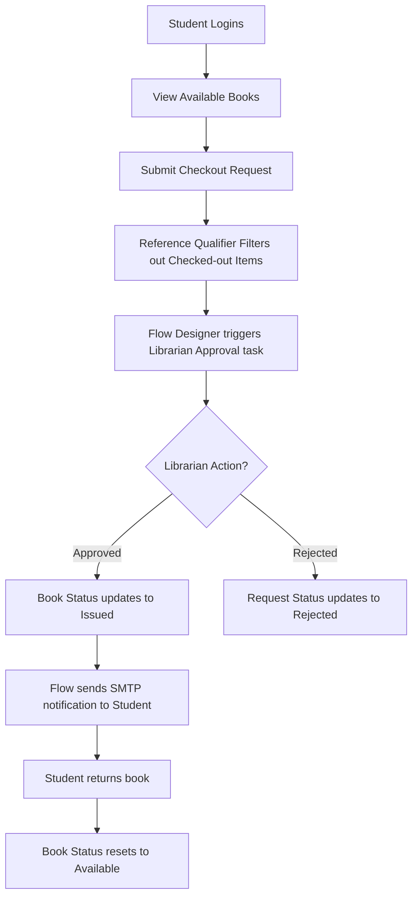

# Smart Library Request Workflow in ServiceNow
## Section 24: Project Conclusion Documentation

## 1. Objective
The objective of this project was to design and implement a Smart Library Request Workflow on the ServiceNow platform that automates the process of requesting, approving, issuing, and returning library books. The solution aimed to reduce manual work, improve efficiency, strengthen security through role-based access control (RBAC), and provide better visibility into library operations.

## 2. Project Overview
The Smart Library Request Workflow was developed using ServiceNow's out-of-the-box (OOTB) capabilities, including custom tables, Flow Designer, UI Policies, Access Control Lists (ACLs), Reference Qualifiers, and Reports. The application provides a digital platform where students can submit borrow requests, librarians can manage approvals and book inventory, and administrators can monitor system performance through reporting dashboards.

Throughout the project, every major phase—from planning and configuration to testing and documentation—was successfully completed.

---

## 3. Project Achievements
The project successfully delivered against its technical objectives:
* Created separate Student (`x_library.student`) and Librarian (`x_library.librarian`) roles.
* Designed custom Book (`u_book`) and Borrow Request (`u_borrow_request`) tables.
* Configured all required database columns, reference relationships, and default values.
* Implemented Reference Qualifiers to filter lookups, displaying only available books.
* Automated the checkout approval process and SMTP email dispatch using Flow Designer.
* Applied UI Policies to dynamically control visibility and enforce mandatory fields.
* Implemented Access Control Lists (ACLs) to harden database tables.
* Generated horizontal bar charts to analyze borrowing frequency.
* Conducted validation suites under user impersonation.
* Compiled a comprehensive setup and technical blueprint manual.

#### Figure 1: Custom tables registered inside the ServiceNow instance

---

## 4. End-to-End Workflow Execution
The application automates the entire request checkout lifecycle, routing approvals and updating physical stocks:

#### Figure 2: Student checkout log form view verifying security locking rules

---

## 5. Key Features Delivered

| Functional Target | ServiceNow Core Component | Implemented Security / Automation Logic |
| :--- | :--- | :--- |
| **Role-Based Access** | User Administration Roles | Student and Librarian custom roles |
| **Book Inventory** | Custom Tables (`u_book`) | Columns for Title, Author, ISBN, and Status |
| **Borrow Tracking** | Custom Tables (`u_borrow_request`)| One-to-many reference matching user to selected book |
| **Approval Engine** | Flow Designer Studio | Ask for Approval step mapping to Librarian group |
| **Stock Check** | Reference Qualifiers | Filters book selectors dynamically: `Status = Available` |
| **Dynamic Form UX** | UI Policies | Shows `Return Date` dynamically and sets it mandatory |
| **Database Security** | Access Control Lists (ACLs) | Restricts write/delete permissions to librarians |
| **SMTP Notifications** | Email Notification Action | Automatic dispatch of approval confirmation emails |
| **Analytics Dashboard** | Report Designer | Bar chart aggregating approved borrow objects |

---

## 6. Business Benefits
* **Reduced Manual Effort**: Replaces ledger books and paper forms with state-driven digital records.
* **Fulfillment Visibility**: Allows users and librarians to monitor reservation states in real time.
* **Hardened Security Profiles**: Role-based access ensures sensitive administrative tasks are locked out from student view.
* **Accurate Book Allocations**: Simple Reference Qualifiers prevent duplicate checkouts.
* **Proactive Inventory Checks**: Reporting dashboards highlight hot items and assist resource budgeting.

#### Figure 3: Dynamic variables and validations on the Borrow Request layout

---

## 7. Testing Summary
To verify data integrity, test scripts were executed in a sandbox PDI environment:

| Test Case | Scenario | Expected Outcome | Result |
| :--- | :--- | :--- | :---: |
| **TC-001** | Student submits borrow request | Request logs at status `Requested`, triggering Flow | ✅ Passed |
| **TC-002** | Librarian approves transaction | Request status updates to `Approved`, Book status to `Issued` | ✅ Passed |
| **TC-003** | Auto status update | Book status resets to `Available` upon checkout close | ✅ Passed |
| **TC-004** | Reference Qualifier lookup | Checked-out books are hidden from selection catalog | ✅ Passed |
| **TC-005** | UI Policy validation | Return Date field requires input only when state = `Issued` | ✅ Passed |
| **TC-006** | Database ACL restrictions | Student blocked from modifying approved records | ✅ Passed |
| **TC-007** | Report aggregation | Approved requests populate bar chart; rejected records ignored | ✅ Passed |

#### Figure 4: ACL rules mapping write permissions on request records

---

## 8. Learning Outcomes
The implementation of the Smart Library Request Workflow project facilitated practical experience in several core ServiceNow administration and design concepts:
* Custom Application Scope Management.
* Platform Security Rules (Roles, Groups, and ACL evaluations).
* Schema Configurations (Tables, dictionary columns, references).
* Data Lookup Filtering (Reference Qualifiers).
* Flow Automation (Flow Designer rules, branching logic, email notifications).
* User Interface Controls (Dynamic Client UI Policies).
* Business Intelligence (Reporting charts and sharing dashboards).
* Sandbox Testing (Impersonation validation scripts).

---

## 9. Future Enhancements
The application can be scaled with additional features:
* **Overdue Notifications**: Scheduled scripts checking due dates to trigger automated email/SMS reminders.
* **Financial Integrations**: Penalty calculators tracking overdue books.
* **QR Codes**: Barcode scanning mechanisms integrated into librarians' counter tasks for check-in.
* **Expanded Resource Booking**: Scaling the portal to include study rooms and lab equipment booking.

#### Figure 5: Aggregate analytics bar chart (reporting foundation)

---

## 10. Conclusion
The Smart Library Request Workflow project successfully streamlined the process of borrowing and managing books within the ServiceNow platform by integrating role-based access, automated approvals, and workflow automation. Students can easily submit borrow requests, while librarians efficiently review, approve, issue, and manage books with appropriate validations. Features such as Reference Qualifiers, UI Policies, Access Control Lists (ACLs), Flow Designer, email notifications, and reporting improve efficiency, transparency, and data accuracy. The project demonstrates practical implementation of ServiceNow application development concepts and provides a scalable foundation that can be expanded to support additional academic services such as laboratory equipment requests, study room reservations, and digital resource management.
