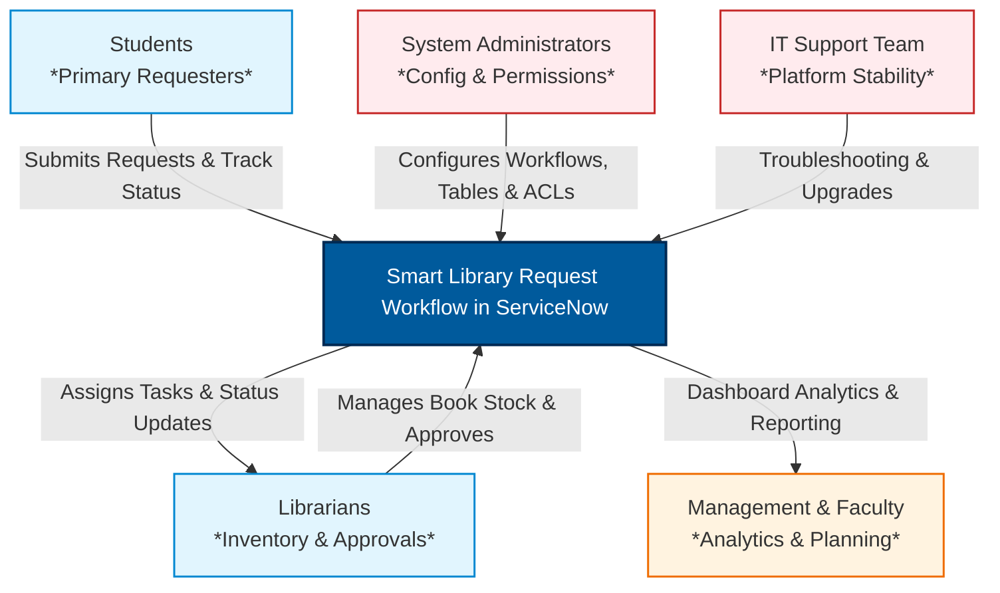
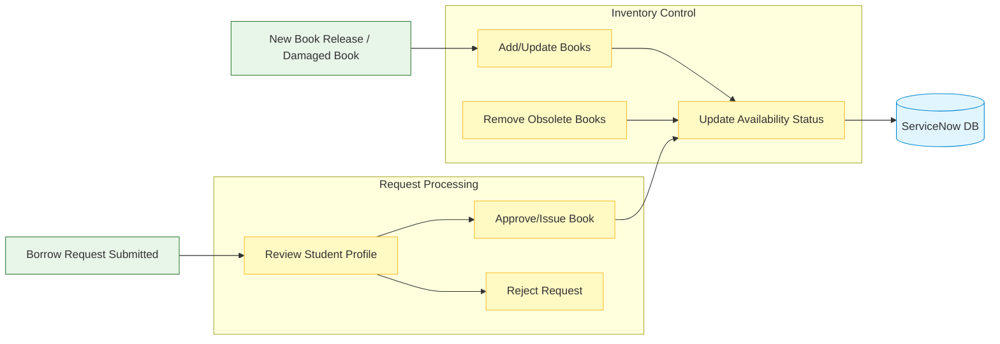
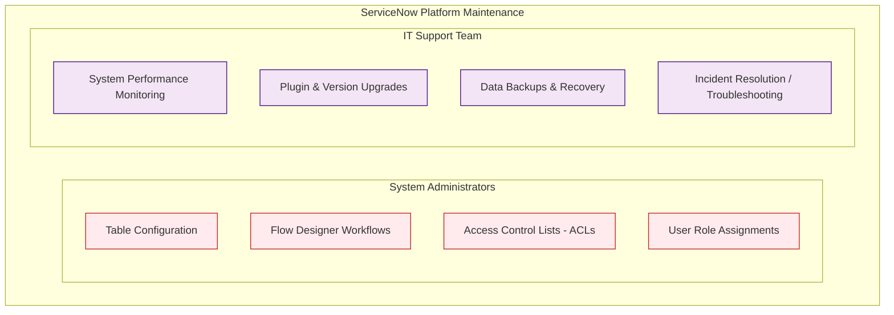
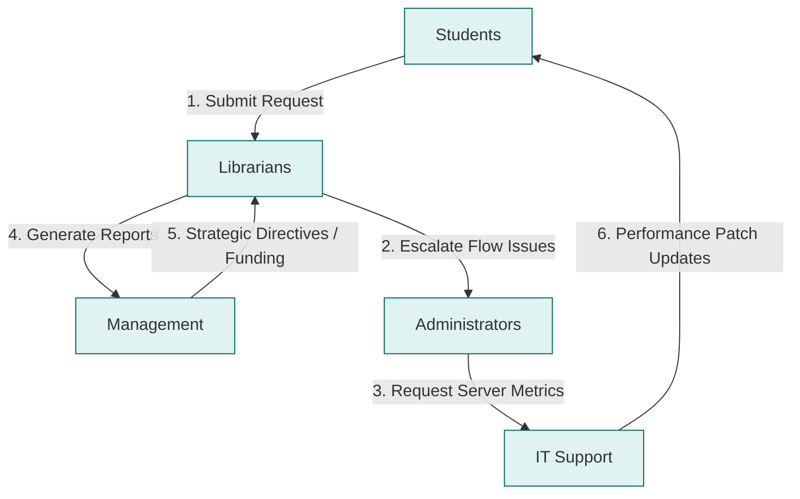

# Smart Library Request Workflow in ServiceNow
## Section 3: Stakeholder Mapping Documentation

## 1. Introduction
Every successful software project involves multiple stakeholders who contribute to its planning, development, implementation, and maintenance. A stakeholder is any individual, group, or organization that can influence or is affected by the project. Identifying stakeholders and understanding their roles ensures that the system meets business requirements and user expectations.

For the Smart Library Request Workflow in ServiceNow, stakeholder mapping helps define the responsibilities, expectations, and interactions of different users involved in the library management process. This enables effective communication, smooth workflow execution, and efficient decision-making throughout the project lifecycle.

## 2. Purpose of Stakeholder Mapping
The primary purpose of stakeholder mapping is to:
* Identify all users involved in the project.
* Define responsibilities for each stakeholder.
* Understand stakeholder expectations.
* Improve communication among project participants.
* Ensure smooth implementation and operation of the system.
* Support better decision-making and resource planning.

### Figure 1: Stakeholder relationship overview for the Smart Library Request Workflow

---

## 3. Stakeholders and Their Roles

### 3.1 Students
Students are the primary users of the Smart Library Request Workflow. They interact with the system through the ServiceNow portal to search for books, submit borrow requests, and monitor the status of their requests.

* **Responsibilities**:
  * Search available books.
  * Submit borrow requests.
  * Track request status.
  * View borrowing history.
  * Return borrowed books within the due date.
* **Expectations**:
  * Easy-to-use interface.
  * Fast request processing.
  * Real-time request status updates.
  * Accurate book availability information.
  * Automated notifications.
* **Benefits**:
  * Convenient online access.
  * Reduced waiting time.
  * Transparent borrowing process.
  * Improved user experience.

---

### 3.2 Librarians
Librarians are responsible for managing the daily operations of the library. They oversee book inventory, process borrow requests, maintain records, and generate reports.

* **Responsibilities**:
  * Add new books.
  * Update existing book details.
  * Remove obsolete books.
  * Approve or reject borrow requests.
  * Update book status.
  * Maintain inventory records.
  * Generate reports.
* **Expectations**:
  * Simplified workflow.
  * Accurate inventory tracking.
  * Faster request management.
  * Reduced manual workload.
  * Reliable reporting tools.
* **Benefits**:
  * Improved productivity.
  * Centralized management.
  * Better inventory control.
  * Efficient request handling.

#### Figure 2: Librarian operations lifecycle

---

### 3.3 System Administrators
System Administrators configure and maintain the ServiceNow platform. They ensure the application functions correctly, remains secure, and supports organizational requirements.

* **Responsibilities**:
  * Create application tables.
  * Configure workflows.
  * Manage user accounts.
  * Assign roles.
  * Configure Access Control Lists (ACLs).
  * Maintain system security.
  * Monitor application performance.
  * Perform upgrades and maintenance.
* **Expectations**:
  * Stable platform.
  * Secure configuration.
  * Easy maintenance.
  * Scalable application.
  * Efficient workflow execution.
* **Benefits**:
  * Centralized administration.
  * Improved security.
  * Simplified configuration management.
  * Better system reliability.

---

### 3.4 Management / Faculty
Management and faculty members use analytical reports generated by the system to monitor library utilization and make informed decisions.

* **Responsibilities**:
  * Review library reports.
  * Analyze borrowing trends.
  * Monitor resource utilization.
  * Plan future library acquisitions.
  * Evaluate library performance.
* **Expectations**:
  * Accurate reports.
  * Real-time analytics.
  * Easy-to-understand dashboards.
  * Reliable statistics.
* **Benefits**:
  * Better decision-making.
  * Efficient resource allocation.
  * Improved planning.
  * Enhanced library services.

---

### 3.5 IT Support Team
The IT Support Team is responsible for ensuring the technical stability of the application. They assist users, troubleshoot issues, perform upgrades, and maintain overall system reliability.

* **Responsibilities**:
  * Provide technical support.
  * Resolve application issues.
  * Perform software updates.
  * Monitor system performance.
  * Backup application data.
  * Maintain application availability.
* **Expectations**:
  * Stable application.
  * Minimal downtime.
  * Efficient issue resolution.
  * Secure infrastructure.
* **Benefits**:
  * Improved system reliability.
  * Reduced operational interruptions.
  * Better user support.
  * Enhanced application performance.

#### Figure 3: Platform operations and technical support separation

---

## 4. Stakeholder Interaction
The stakeholders interact with the Smart Library Request Workflow as follows:
1. Students submit book requests through the ServiceNow portal.
2. Librarians review and approve or reject the requests.
3. The workflow automatically updates book availability.
4. Management reviews reports and analytics for planning.
5. System Administrators maintain application configuration and security.
6. IT Support ensures continuous system availability and resolves technical issues.

This interaction creates an integrated and efficient library management process.

---

## 5. Stakeholder Communication Matrix

| Stakeholder | Primary Responsibility | Interaction with System |
| :--- | :--- | :--- |
| **Students** | Request and track books | Service Portal |
| **Librarians** | Manage books and approvals | ServiceNow Application |
| **System Administrators** | Configure and maintain the system | Platform Administration |
| **Management / Faculty** | Review reports and analytics | Dashboards & Reports |
| **IT Support Team** | Technical maintenance and support | System Monitoring & Maintenance |

#### Figure 4: Communication and collaboration among stakeholders

---

## 6. Expected Outcome
After stakeholder mapping, the project team will have a clear understanding of:
* Stakeholder responsibilities.
* User expectations.
* System interactions.
* Communication flow.
* Decision-making responsibilities.
* Support and maintenance processes.

This clarity ensures efficient collaboration throughout the project lifecycle.

## 7. Benefits of Stakeholder Mapping
* Clearly defined roles and responsibilities.
* Improved communication.
* Better project planning.
* Faster issue resolution.
* Increased stakeholder satisfaction.
* Better resource management.
* Reduced project risks.
* Improved collaboration.
* Enhanced system adoption.
* Successful project implementation.

## 8. Conclusion
Stakeholder Mapping is a critical step in the development of the Smart Library Request Workflow in ServiceNow. It identifies all individuals and groups involved in the project and clearly defines their responsibilities, expectations, and interactions with the system. Understanding stakeholder roles helps ensure effective communication, secure system operation, efficient workflow execution, and successful project delivery. By aligning the needs of students, librarians, administrators, management, and IT support, the project establishes a strong foundation for an efficient and reliable digital library management system.
