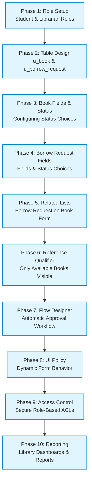
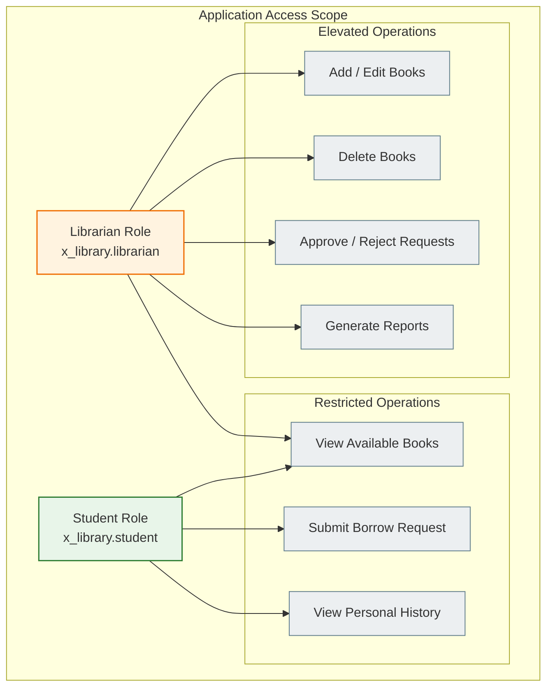
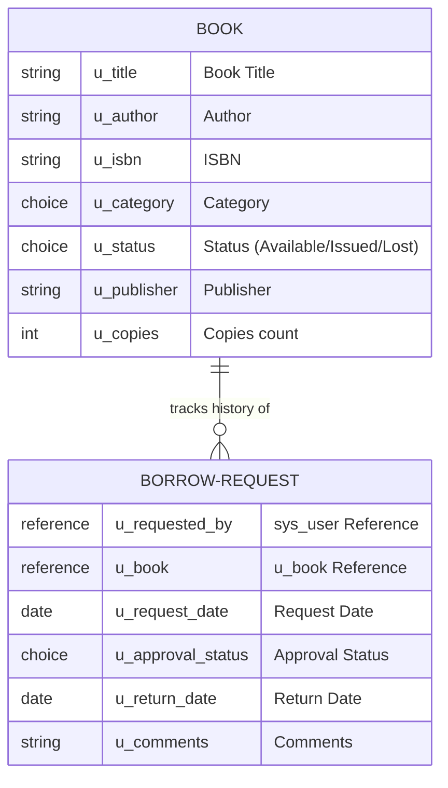
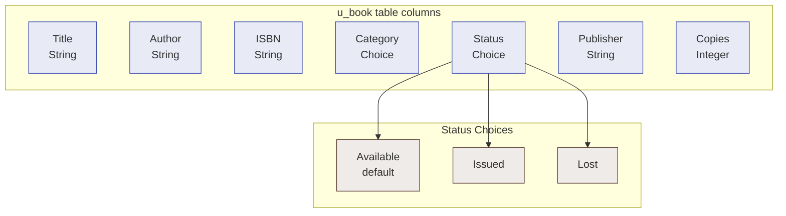

# Smart Library Request Workflow in ServiceNow
## Section 4: Execution Roadmap (Part 1)

## 1. Introduction
An execution roadmap is a structured implementation plan that outlines the sequence of activities required to successfully develop and deploy a project. It acts as a blueprint for the development team by defining the major phases, implementation steps, and expected deliverables.

For the Smart Library Request Workflow in ServiceNow, the execution roadmap provides a systematic approach to building a role-based library management application. The roadmap covers the complete development lifecycle, including role creation, table design, form configuration, workflow automation, security implementation, reporting, testing, and deployment.

Following this roadmap ensures that the project is implemented in a logical sequence while maintaining consistency, security, and scalability throughout the development process.

### Figure 1: High-level execution roadmap for developing the Smart Library Request Workflow in ServiceNow


---

## 2. Objective
The objective of the execution roadmap is to provide a step-by-step implementation strategy for building the Smart Library Request Workflow application. The roadmap helps developers understand the order of implementation and ensures that every project component is configured correctly before moving to the next phase.

---

## 3. Execution Roadmap Overview
The Smart Library Request Workflow will be developed through ten major implementation phases.

| Phase | Activity | Expected Output |
| :--- | :--- | :--- |
| **Phase 1** | Role Setup | Student and Librarian roles created |
| **Phase 2** | Table Design | Book and Borrow Request tables created |
| **Phase 3** | Book Configuration | Book fields and status choices configured |
| **Phase 4** | Borrow Request Configuration | Request fields and statuses configured |
| **Phase 5** | Related Lists | Borrow Requests displayed on Book form |
| **Phase 6** | Reference Qualifier | Only available books displayed for requests |
| **Phase 7** | Flow Designer | Automatic approval workflow implemented |
| **Phase 8** | UI Policy | Dynamic form behavior configured |
| **Phase 9** | Access Control | Secure role-based permissions applied |
| **Phase 10**| Reporting | Library reports and dashboards created |

---

## 4. Phase 1 – Role Setup

### Purpose
The first phase focuses on creating user roles that define permissions and responsibilities within the application. Role-based access ensures that users can perform only the actions appropriate to their responsibilities.

### Roles to be Created

#### Student Role (`x_library.student`)
The Student role allows users to:
* View available books.
* Submit borrow requests.
* Track request status.
* View personal borrowing history.

*Students cannot*: Modify book records, approve requests, delete records, or access administrative configurations.

#### Librarian Role (`x_library.librarian`)
The Librarian role allows users to:
* Add books.
* Edit book information.
* Delete book records.
* Approve or reject borrow requests.
* Update book availability.
* Generate reports.
* Manage library inventory.

### Role Benefits
* Secure application access.
* Clear separation of responsibilities.
* Improved system security.
* Simplified permission management.

### Figure 2: Conceptual representation of role-based access for students and librarians


---

## 5. Phase 2 – Table Design

### Purpose
The second phase focuses on designing the application's database by creating custom tables that store library information. Two primary tables will be created.

#### Book Table (`u_book`)
The Book table stores information about every book available in the library. This table acts as the master inventory for all library books.
* **Primary Information**: Book Title, Author, ISBN, Category, Status, Publisher, Number of Copies.

#### Borrow Request Table (`u_borrow_request`)
The Borrow Request table stores every borrowing transaction performed by students. Each request record references one book from the Book table.
* **Primary Information**: Requested By, Book Reference, Request Date, Approval Status, Return Date, Comments.

### Relationship
```
[Book Table] 1 ─────── 0..* [Borrow Request Table]
```
This one-to-many relationship enables multiple borrow requests to be associated with a single book over time.

### Figure 3: Book and Borrow Request tables with a one-to-many relationship


### Benefits
* Centralized data storage.
* Easy relationship management.
* Improved reporting.
* Better data consistency.

---

## 6. Phase 3 – Add Fields to Book Table

### Purpose
After creating the Book table, the next step is to add fields that capture essential information about each book.

### Fields

| Field Name | Data Type | Description |
| :--- | :--- | :--- |
| **Title** | String | Name of the book |
| **Author** | String | Book author |
| **ISBN** | String | Unique book identifier |
| **Category** | Choice | Book category |
| **Status** | Choice | Current availability |
| **Publisher** | String | Publisher name |
| **Copies** | Integer | Number of available copies |

### Status Choices
The Status field is configured as a Choice field with predefined values:

| Value | Purpose |
| :--- | :--- |
| **Available** | Book is ready to borrow (Default) |
| **Issued** | Book is currently borrowed |
| **Lost** | Book has been reported lost |

The default value is **Available**, ensuring that newly added books can immediately be requested by students.

### Figure 4: Configuration of fields and status choices in the Book table


### Expected Outcome
After completing this phase:
* The Book table contains all required fields.
* Every book has a defined status.
* Librarians can maintain complete book information.
* The system is prepared for borrow request processing.

---

## 7. Summary of Part 1
In this part of the execution roadmap, the foundation of the Smart Library Request Workflow has been established by:
1. Defining user roles for secure access.
2. Creating the core application tables.
3. Designing the Book table with essential fields.
4. Establishing relationships between books and borrow requests.

These steps provide the structural framework required for the remaining development phases.
