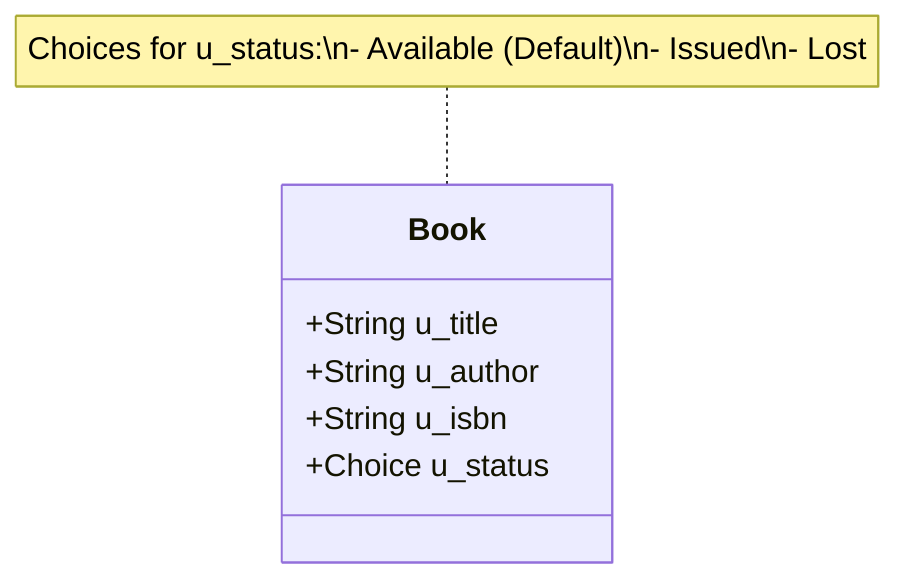
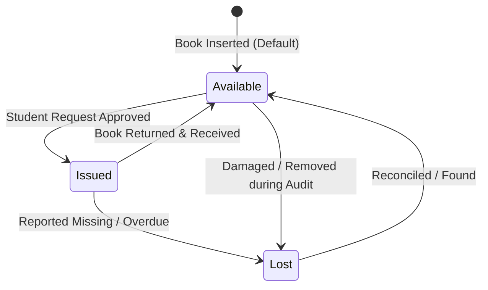

# Smart Library Request Workflow in ServiceNow
## Section 8: Add Fields to Book Table Documentation

## 1. Objective
The objective of this task is to configure the Book (`u_book`) table by adding the required fields to store complete information about each library book. These fields help librarians maintain accurate book records and enable the system to track book availability during the borrowing process.

## 2. Introduction
After creating the Book table, the next step is to add the necessary fields that define the attributes of each book. In ServiceNow, fields (also called dictionary entries) store specific pieces of information for every record in a table.

For the Smart Library Request Workflow, the Book table requires the following fields:
* **Title**
* **Author**
* **ISBN**
* **Status**

The **Status** field is configured as a Choice field with predefined values to track the availability of books.

---

## 3. Prerequisites
Before performing this task, ensure that:
* ServiceNow Personal Developer Instance (PDI) is active.
* Administrator (`admin`) access is available.
* The Book (`u_book`) table has been created successfully (via Task 6).

---

## 4. Fields to be Added

| Field Label | Column Name | Data Type | Description |
| :--- | :--- | :--- | :--- |
| **Title** | `u_title` | String | Stores the title of the book |
| **Author** | `u_author` | String | Stores the author's name |
| **ISBN** | `u_isbn` | String | Stores the International Standard Book Number (unique ID) |
| **Status** | `u_status` | Choice | Indicates the availability status of the book |

---

## 5. Implementation Steps

### Step 1: Open the Book Table
1. Log in to your ServiceNow instance.
2. Click **All** in the Application Navigator.
3. Search for **Tables** and open **System Definition** ──> **Tables**.
4. Search for `Book` and open the record for table `u_book`.

#### UI Mockup 1: u_book Table Record Form
```
================================================================================
|  Table  |  Book [u_book]                                     [ Update ] [ < ] |
================================================================================
|  * Label:    [ Book                                ]  Name: [ u_book        ] |
|  * Extends:  [ -- None --                          ]  Active: [x]             |
================================================================================
```
*Figure 1: Opening the Book (u_book) table.*

---

### Step 2: Open the Columns (Dictionary) Related List
1. Scroll to the bottom of the Book table form.
2. Locate the **Columns** related list tab.
3. Click the **New** button. This opens the Dictionary Entry form for creating a new field.

#### UI Mockup 2: Columns (Dictionary) Related List
```
================================================================================
|  Columns (Dictionary)  [ New ]                                               |
================================================================================
|  Column Label (▲) | Column Name | Type     | Max Length | Active | Default    |
--------------------------------------------------------------------------------
|  sys_id           | sys_id      | GUID     | 32         | true   |            |
|  sys_created_on   | sys_created | DateTime | 40         | true   |            |
================================================================================
```
*Figure 2: Columns (Dictionary) related list of the Book table.*

---

### Step 3: Create the Title Field
1. On the Dictionary Entry form, enter:
   * **Column Label**: `Title`
   * **Type**: `String`
2. Click **Submit**.

---

### Step 4: Create the Author Field
1. Click **New** again in the Columns related list.
2. Enter:
   * **Column Label**: `Author`
   * **Type**: `String`
3. Click **Submit**.

---

### Step 5: Create the ISBN Field
1. Click **New**.
2. Enter:
   * **Column Label**: `ISBN`
   * **Type**: `String`
3. Click **Submit**.

---

### Step 6: Create the Status Field
1. Click **New**.
2. Enter:
   * **Column Label**: `Status`
   * **Type**: `Choice`
3. Click **Submit**.

#### UI Mockup 3: Creating the Status Field as a Choice Field
```
================================================================================
|  Dictionary Entry  |  New Record                              [ Submit ] [ < ]|
================================================================================
|  * Table:           [ Book [u_book]                                      ]   |
|  * Type:            [ Choice                                             |▼] |
|  * Column Label:    [ Status                                             ]   |
|  * Column Name:     [ u_status                                           ]   |
================================================================================
```
*Figure 3: Creating the Status field as a Choice field.*

---

## 6. Configure Choice Values
1. Open the newly created **Status** field record from the Columns related list.
2. Scroll down to the **Choices** related list.
3. Click **New** and add the following three options:

| Label | Value | Sequence |
| :--- | :--- | :---: |
| **Available** | `Available` | 1 |
| **Issued** | `Issued` | 2 |
| **Lost** | `Lost` | 3 |

4. In the **Default value** field on the Status field dictionary form, enter:
   `Available`
5. Click **Update**.

#### Figure 4: Status Choice values configured in ServiceNow


---

## 7. Verify the Book Form
1. In the Application Navigator, type `u_book.do` in the search filter (or navigate to Book module).
2. Check that the new fields appear on the form.

#### Figure 5: Book form displaying all configured fields in ServiceNow UI


---

## 8. Book Table Structure



---

## 9. Status Workflow
The primary inventory lifecycle for a physical book proceeds through the following status transitions:


The Status field helps librarians track the availability of books throughout the borrowing process.

---

## 10. Expected Outcome
After completing this task:
* The Book table contains all required fields.
* The Status field is configured as a Choice field.
* Choice values (Available, Issued, Lost) are added.
* The default value is set to Available.
* The Book form is ready for inventory management.

## 11. Benefits
* **Centralized Data Storage**: Maintains metadata in dedicated dictionary entries.
* **Easy Maintenance**: Standardized forms for librarian inputs.
* **Real-time Tracking**: Instant visibility into the availability of books.
* **Automation Ready**: Feeds data into the Flow Designer for check-out logic.
* **Consistency**: Restricts statuses to predefined choices, eliminating typos.

## 12. Conclusion
The successful configuration of the Book table provides the Smart Library Request Workflow with a structured repository for managing library resources. By adding the Title, Author, ISBN, and Status fields, the application can maintain detailed book records and accurately track availability. The Choice field for Status ensures standardized values, enabling seamless workflow automation and reliable reporting in subsequent stages of the project.
