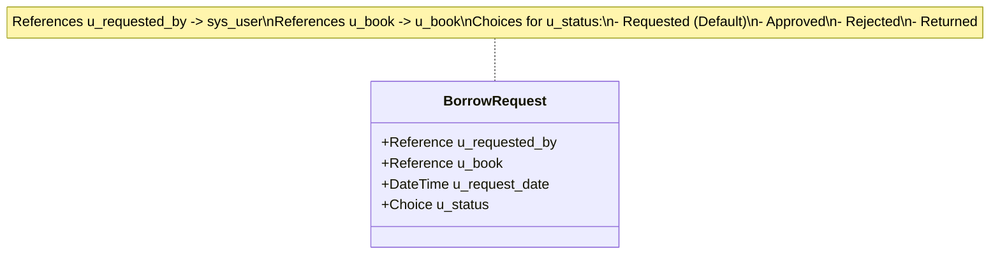
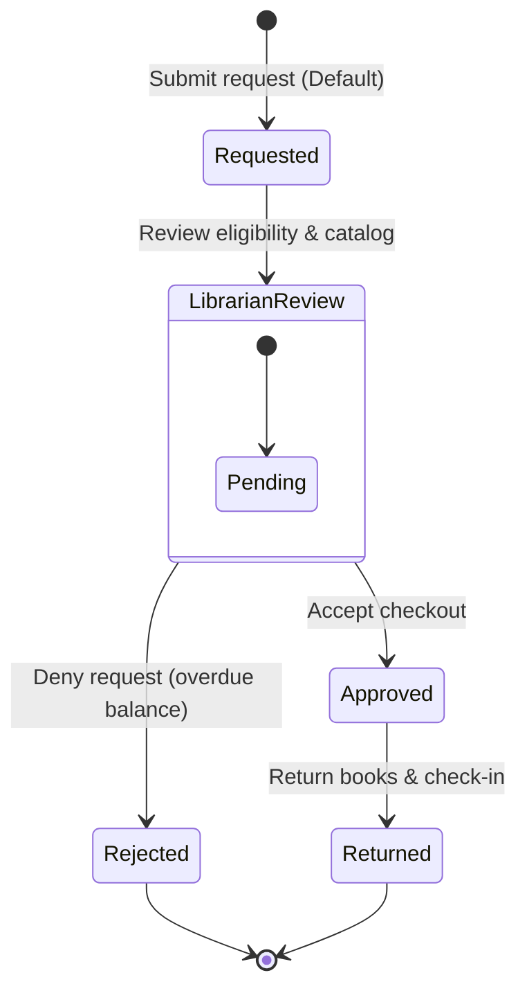

# Smart Library Request Workflow in ServiceNow
## Section 9: Add Fields to Borrow Request Table Documentation

## 1. Objective
The objective of this task is to configure the Borrow Request (`u_borrow_request`) table by adding the required fields to capture information about book borrowing requests. These fields enable students to submit requests, librarians to process them, and the system to track the status of each request throughout its lifecycle.

## 2. Introduction
The Borrow Request table is one of the core components of the Smart Library Request Workflow application. It records every borrowing request submitted by students and links it to the corresponding book. Proper field configuration allows the system to maintain accurate request information, automate approval workflows, and generate reports.

The Borrow Request table requires the following fields:
* **Requested By**
* **Book**
* **Request Date**
* **Status**

Among these, the **Requested By** and **Book** fields are configured as Reference fields to establish relationships with other tables, while the **Status** field is configured as a Choice field to track the progress of each request.

---

## 3. Prerequisites
Before performing this task, ensure that:
* ServiceNow Personal Developer Instance (PDI) is active.
* Administrator (`admin`) access is available.
* The Book (`u_book`) and Borrow Request (`u_borrow_request`) tables have already been created (via Task 6).

---

## 4. Fields to be Added

| Field Label | Column Name | Data Type | Reference / Description |
| :--- | :--- | :--- | :--- |
| **Requested By** | `u_requested_by` | Reference | References the User (`sys_user`) table |
| **Book** | `u_book` | Reference | References the Book (`u_book`) table |
| **Request Date** | `u_request_date` | Date/Time | Records submission timestamp |
| **Status** | `u_status` | Choice | Tracks transaction stages |

---

## 5. Implementation Steps

### Step 1: Open the Borrow Request Table
1. Log in to your ServiceNow instance.
2. Click **All** in the Application Navigator.
3. Search for **Tables** and open **System Definition** ──> **Tables**.
4. Search for `Borrow Request` and open the record for `u_borrow_request`.

#### UI Mockup 1: u_borrow_request Table Configuration
```
================================================================================
|  Table  |  Borrow Request [u_borrow_request]                 [ Update ] [ < ] |
================================================================================
|  * Label:    [ Borrow Request                      ]  Name: [ u_borrow_req  ] |
|  * Extends:  [ -- None --                          ]  Active: [x]             |
================================================================================
```
*Figure 1: Opening the Borrow Request (u_borrow_request) table.*

---

### Step 2: Open the Columns (Dictionary) Related List
1. Scroll to the bottom of the Borrow Request table form.
2. Locate the **Columns** related list tab.
3. Click the **New** button.

#### UI Mockup 2: Columns (Dictionary) Related List
```
================================================================================
|  Columns (Dictionary)  [ New ]                                               |
================================================================================
|  Column Label (▲) | Column Name | Type     | Max Length | Active | Default    |
--------------------------------------------------------------------------------
|  sys_id           | sys_id      | GUID     | 32         | true   |            |
================================================================================
```
*Figure 2: Columns (Dictionary) related list of the Borrow Request table.*

---

### Step 3: Create the Requested By Field
1. Click **New** in the columns related list.
2. Enter the following properties:
   * **Column Label**: `Requested By`
   * **Type**: `Reference`
   * **Reference**: `User [sys_user]`
3. Click **Submit**.

---

### Step 4: Create the Book Field
1. Click **New** again in the columns related list.
2. Enter the following properties:
   * **Column Label**: `Book`
   * **Type**: `Reference`
   * **Reference**: `Book [u_book]`
3. Click **Submit**.

#### UI Mockup 3: Configuring the Book Field
```
================================================================================
|  Dictionary Entry  |  New Record                              [ Submit ] [ < ]|
================================================================================
|  * Table:           [ Borrow Request [u_borrow_request]                  ]   |
|  * Type:            [ Reference                                          |▼] |
|  * Column Label:    [ Book                                               ]   |
|  * Column Name:     [ u_book                                             ]   |
|  * Reference:       [ Book [u_book]                                      |▼] |
================================================================================
```
*Figure 3: Configuring the Book field as a Reference field.*

---

### Step 5: Create the Request Date Field
1. Click **New**.
2. Enter:
   * **Column Label**: `Request Date`
   * **Type**: `Date/Time`
3. Click **Submit**.

---

### Step 6: Create the Status Field
1. Click **New**.
2. Enter:
   * **Column Label**: `Status`
   * **Type**: `Choice`
3. Click **Submit**.

#### UI Mockup 4: Creating the Status Choice Field
```
================================================================================
|  Dictionary Entry  |  New Record                              [ Submit ] [ < ]|
================================================================================
|  * Table:           [ Borrow Request [u_borrow_request]                  ]   |
|  * Type:            [ Choice                                             |▼] |
|  * Column Label:    [ Status                                             ]   |
|  * Column Name:     [ u_status                                           ]   |
================================================================================
```
*Figure 4: Creating the Status field as a Choice field.*

---

## 6. Configure Status Choices
1. Open the newly created **Status** field record from the Columns related list.
2. Scroll down to the **Choices** related list.
3. Click **New** and add the following four options:

| Label | Value | Sequence |
| :--- | :--- | :---: |
| **Requested** | `Requested` | 1 |
| **Approved** | `Approved` | 2 |
| **Rejected** | `Rejected` | 3 |
| **Returned** | `Returned` | 4 |

4. In the **Default value** field on the Status field dictionary form, enter:
   `Requested`
5. Click **Update**.

#### Figure 5: Status choice values configured for the Borrow Request table


---

## 7. Verify the Borrow Request Form
1. Type `u_borrow_request.do` in the search filter (or navigate to Borrow Request module).
2. Check that the new fields are placed correctly on the form.

#### Figure 6: Completed Borrow Request form view in ServiceNow


---

## 8. Borrow Request Table Structure



---

## 9. Request Status Workflow
The transaction lifecycle of a borrow request progresses through the following flow:


The Status field allows the system to monitor the progress of every borrow request from submission to completion.

---

## 10. Expected Outcome
After completing this task:
* The Borrow Request table contains all required fields.
* Reference relationships are established with the User and Book tables.
* The Status field is configured with predefined choices.
* The default status is set to Requested.
* The Borrow Request form is ready for workflow automation.

## 11. Benefits
* **Maintains Complete Borrowing Records**: Captures user, book, timestamps, and stages.
* **Establishes Table Relationships**: Connects inventory (Book) with profiles (User) dynamically.
* **Supports Workflow Automation**: Triggers Flow Designer instances whenever status updates occur.
* **Request Tracking**: Gives students and librarians end-to-end visibility of requests.
* **Enables Reporting**: Feeds analytical databases for active loan and delay metrics.

## 12. Conclusion
The successful configuration of the Borrow Request (`u_borrow_request`) table provides the Smart Library Request Workflow with a structured mechanism for recording and managing book borrowing requests. By adding the Requested By, Book, Request Date, and Status fields, the application can accurately track request details, establish relationships with users and books, and support automated workflows. This configuration forms the foundation for request approvals, notifications, and reporting in subsequent stages of the project.
